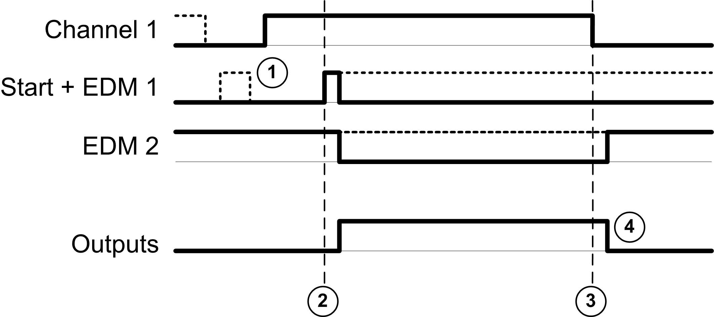

# One Channel Application

One Channel Application

Performance and Safety Integrity Levels

This table describes the performance and safety integrity levels associated to the 1 channel application:

| Application type | Performance Level (PL) and maximum category (IEC/ISO 13849-1) | Maximum Safety Integrity Level (SIL) (IEC/EN 62061) |
| --- | --- | --- |
| 1 channel application | PL c, category 2 | SIL 1 |

Chronogram Convention

The inputs and outputs behavior description may be based on chronograms. In those chronograms, the following convention on signals status applies:

| I/O behavior | Status |
| --- | --- |
| G-SE-0033339.1.gif-high.gif | On |
| G-SE-0033338.1.gif-high.gif | Off |
| G-SE-0033340.1.gif-high.gif | Optional |

Output Activation

Both the safety conditions and the start conditions must be valid before allowing the activation of outputs.

|  |
| --- |
| Warning_Color.gifWARNING |
| UNINTENDED EQUIPMENT OPERATION |
| Do not use either the monitored start or the non-monitored start as a safety function. |
| Failure to follow these instructions can result in death, serious injury, or equipment damage. |

Non-Monitored Start

This table presents the module types available in a 1 channel application with a non-monitored start:

| Reference | Channel 1 | Start + EDM 1 | EDM 2 | Outputs |
| --- | --- | --- | --- | --- |
| TM3SAC5R | +24 Vdc - A1 | Y1-Y2 | – | 13-14  23-24  33-34 |
| TM3SAK6R | S11-S12 | S33-S39 | S41-S42 |

This figure represents the output activation management in a 1 channel application with a non-monitored start:

Events description:

1.Non-monitored start condition is available as long as the start input is on.

The start condition can be valid before the safety input.

The outputs are on only if start + safety input conditions are valid.

2.Safety inputs + start conditions are valid

3.Safety inputs condition invalid

4.The outputs react to the safety input and start conditions with a delay given by system constraints.

Monitored Start

This table presents the module type available in a 1 channel application with a monitored start:

| Reference | Channel 1 | Start + EDM 1 | EDM 2 | Outputs |
| --- | --- | --- | --- | --- |
| TM3SAK6R | S11-S12 | S33-S34 | S41-S42 | 13-14  23-24  33-34 |

This figure represents the output activation management in a 1 channel application with a monitored start:

Events description:

1.Monitored start condition is triggered by a falling edge on the start input.

2.Safety inputs + start conditions are valid

3.Safety inputs condition invalid

4.The outputs react to the safety input and start conditions with a delay given by system constraints.

EIO0000003353.01

© 2019 Schneider Electric. All rights reserved.