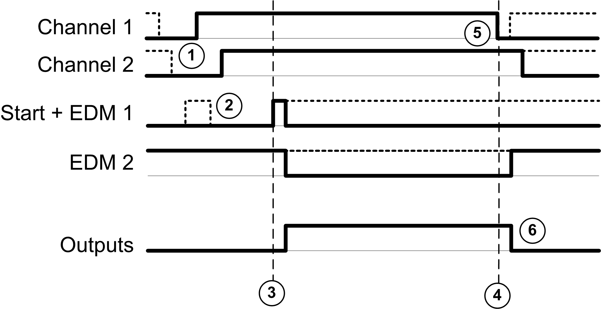

# Two Channel Application

Two Channel Application

Performance and Safety Integrity Levels

This table describes the performance and safety integrity levels associated to the 2 channel application:

| Application type | Performance Level (PL) and maximum category (IEC/ISO 13849-1) | Maximum Safety Integrity Level (SIL) (IEC/EN 62061) |
| --- | --- | --- |
| 2 channel application without short-circuit detection | PL d, category 3 | SIL 2 |
| 2 channel application (2 \* PNP sensors) without short-circuit detection | PL d, category 3 | SIL 2 |
| 2 channel application with short-circuit detection | PL e, category 4 | SIL 3 |
| 2 channel application (PNP + NPN complementary sensors) with short-circuit detection | PL e, category 4 | SIL 3 |

Chronogram Convention

The inputs and outputs behavior description may be based on chronograms. In those chronograms, the following convention on signals status applies:

| I/O behavior | Status |
| --- | --- |
| G-SE-0033339.1.gif-high.gif | On |
| G-SE-0033338.1.gif-high.gif | Off |
| G-SE-0033340.1.gif-high.gif | Optional |

Output Activation

Both the safety conditions and the start conditions must be valid before allowing the activation of outputs.

|  |
| --- |
| Warning_Color.gifWARNING |
| UNINTENDED EQUIPMENT OPERATION |
| Do not use either the monitored start or the non-monitored start as a safety function. |
| Failure to follow these instructions can result in death, serious injury, or equipment damage. |

Non-Monitored Start

This table presents the module types available in a 2 channel application with a non-monitored start:

| Reference | Channel 1 | Channel 2 | Start + EDM 1 | EDM 2 | Outputs |
| --- | --- | --- | --- | --- | --- |
| TM3SAC5R | +24 Vdc - A1 | A2-GND | Y1-Y2 | – | 13-14  23-24  33-34 |
| TM3SAF5R | S11-S12 | S21-S22 | S33-S39 | S41-S42 |
| TM3SAFL5R |
| TM3SAK6R | S21-S22 | S31-S32 |

This figure represents the output activation management in a 2 channel application with a non-monitored start:

Events description:

1.Both S2 and S3 inputs must be set to off before the outputs can be activated. This condition is called interlock. For more information, refer to the TM3 Expansion Modules Programming Guide for your software platform.

2.Non-monitored start condition is available as long as the start input is on.

The start condition can be valid before the safety inputs.

The outputs are on only if start + safety inputs conditions are valid.

3.Safety inputs + start conditions are valid

4.Safety inputs condition invalid

5.At least 1 input is off

6.The outputs react to the safety inputs and start conditions with a delay given by system constraints.

Monitored Start

This table presents the module types available in a 2 channel application with a monitored start:

| Reference | Channel 1 | Channel 2 | Start + EDM 1 | EDM 2 | Outputs |
| --- | --- | --- | --- | --- | --- |
| TM3SAF5R | S11-S12 | S21-S22 | S33-S34 | S41-S42 | 13-14  23-24  33-34 |
| TM3SAFL5R |
| TM3SAK6R | S21-S22 | S31-S32 |

This figure represents the output activation management in a 2 channel application with a monitored start:

Events description:

1.Both S2 and S3 inputs must be set to off before the outputs can be activated. This condition is called interlock. For more information, refer to the TM3 Expansion Modules Programming Guide for your software platform.

2.Monitored start condition is triggered by a falling edge on the start input.

3.Safety inputs + start conditions are valid

4.Safety inputs condition invalid

5.At least 1 input is off

6.The outputs react to the safety inputs and start conditions with a delay given by system constraints.

EIO0000003353.01

© 2019 Schneider Electric. All rights reserved.