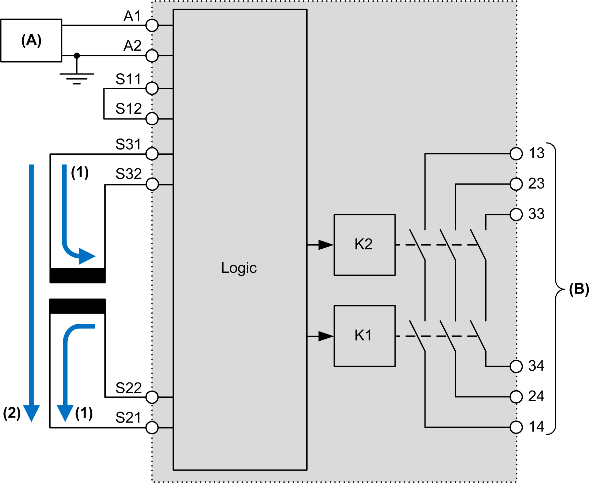

# Safety-Mat Application

Safety-Mat Application

Performance and Safety Integrity Levels

This table describes the performance and safety integrity levels associated to the safety-mat application:

| Application type | Performance Level (PL) and maximum category (IEC/ISO 13849-1) | Maximum Safety Integrity Level (SIL) (IEC/EN 62061) |
| --- | --- | --- |
| Safety-mat application (current source) | PL d, category 3 | SIL 2 |

Description

This table presents the module type available in a safety-mat application:

| Reference | Channel 1 | Channel 2 | Start + EDM 1 | EDM 2 | Outputs |
| --- | --- | --- | --- | --- | --- |
| TM3SAK6R | S21-S22 | S31-S32 | S33-S34 | S41-S42 | 13-14  23-24  33-34 |

This figure represents the current flow in a safety-mat connected to safety inputs:

(A):   Current source

(A1):   24 Vdc

(A2):   GND pin out

(B):   Outputs

(1):   Current flow when the mat is released, relays K1 and K2 are supplied.

(2):   Current flow when the mat is under pressure (mat is stepped on), relays K1 and K2 are not supplied (the mat provides a short circuit path).

EIO0000003353.01

© 2019 Schneider Electric. All rights reserved.