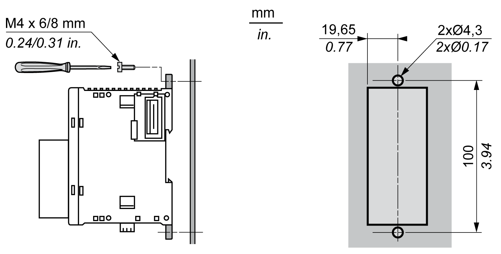

# Mounting a TM3 Safety Module Directly on a Panel Surface

Mounting a TM3 Safety Module Directly on a Panel Surface

Overview

This section shows how to install a TM3 safety module using the panel mounting kit and the module mounting holes layout.

Installing the Panel Mount Kit

| Step | Action |
| --- | --- |
| 1 | Insert the mounting strip TMAM2 into the slot at the top of the TM3 safety module.  G-SE-0032902.1.gif-high.gif |

Mounting Hole Layout

The following diagram shows the mounting holes for a TM3 safety module:

EIO0000003353.01

© 2019 Schneider Electric. All rights reserved.