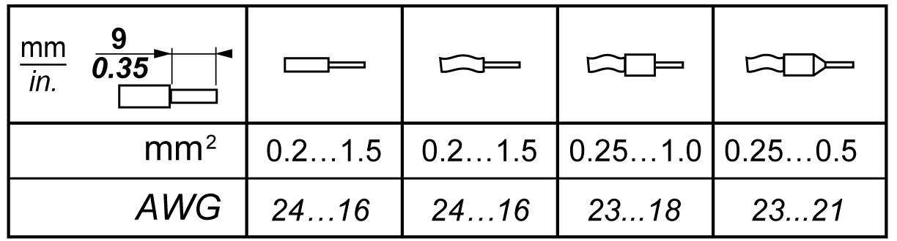
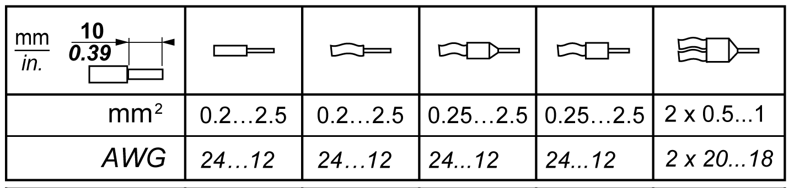
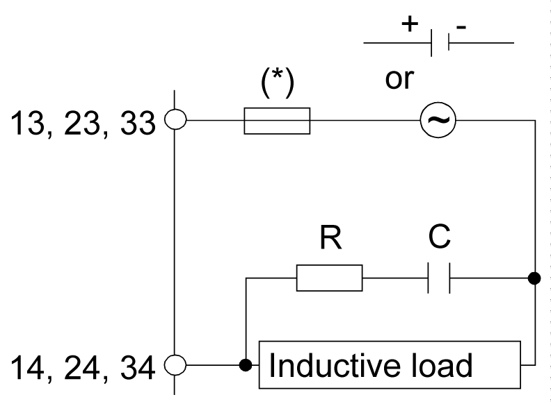
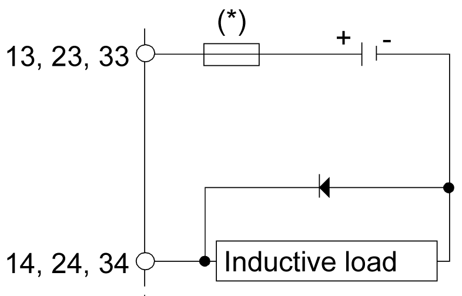
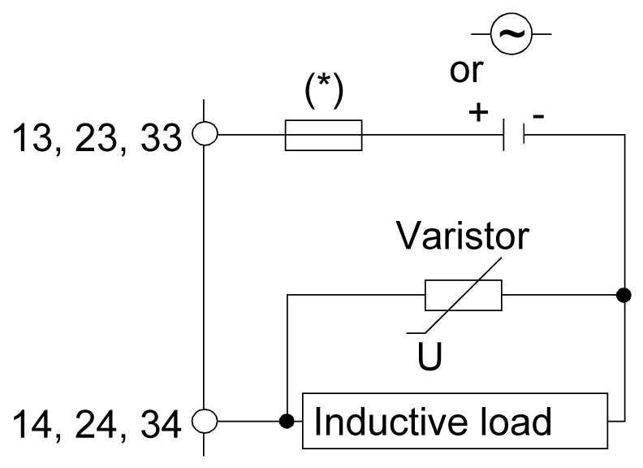

# Wiring Best Practices

Wiring Best Practices

Overview

This section describes the wiring guidelines and associated best practices to be respected when using TM3 safety modules.

|  |
| --- |
| DangerElectrical_Color.gifDanger_Color.gifDANGER |
| HAZARD OF ELECTRIC SHOCK, EXPLOSION OR ARC FLASH |
| oDisconnect all power from all equipment including connected devices prior to removing any covers or doors, or installing or removing any accessories, hardware, cables, or wires except under the specific conditions specified in the appropriate hardware guide for this equipment.  oAlways use a properly rated voltage sensing device to confirm the power is off where and when indicated.  oReplace and secure all covers, accessories, hardware, cables, and wires and confirm that a proper ground connection exists before applying power to the unit.  oUse only the specified voltage when operating this equipment and any associated products. |
| Failure to follow these instructions will result in death or serious injury. |

|  |
| --- |
| Warning_Color.gifWARNING |
| LOSS OF CONTROL |
| oThe designer of any control scheme must consider the potential failure modes of control paths and, for certain critical control functions, provide a means to achieve a safe state during and after a path failure. Examples of critical control functions are emergency stop and overtravel stop, power outage and restart.  oSeparate or redundant control paths must be provided for critical control functions.  oSystem control paths may include communication links. Consideration must be given to the implications of unanticipated transmission delays or failures of the link.  oObserve all accident prevention regulations and local safety guidelines.1  oEach implementation of this equipment must be individually and thoroughly tested for proper operation before being placed into service. |
| Failure to follow these instructions can result in death, serious injury, or equipment damage. |

1 For additional information, refer to NEMA ICS 1.1 (latest edition), "Safety Guidelines for the Application, Installation, and Maintenance of Solid State Control" and to NEMA ICS 7.1 (latest edition), "Safety Standards for Construction and Guide for Selection, Installation and Operation of Adjustable-Speed Drive Systems" or their equivalent governing your particular location.

Functional Ground (FE) on a Top Hat Section Rail (DIN Rail)

The top hat section rail (DIN Rail) for your system is common with the functional ground ([FE](../glossary/glossary.htm#XREF_D_SE_0024697_704)) plane and must be mounted on a conductive backplane.

|  |
| --- |
| Warning_Color.gifWARNING |
| UNINTENDED EQUIPMENT OPERATION |
| Connect the DIN rail to the functional ground (FE) of your installation. |
| Failure to follow these instructions can result in death, serious injury, or equipment damage. |

Wiring Guidelines

The following rules must be applied when wiring a TM3 safety module:

oI/O and communication wiring must be kept separate from the power wiring. Route these 2 types of wiring in separate cable ducting.

oVerify that the operating conditions and environment are within the specification values.

oUse proper wire sizes to meet voltage and current requirements.

oUse copper conductors.

oUse twisted pair, shielded cables for I/O.

oUse twisted pair, shielded cables for networks, and fieldbus.

|  |
| --- |
| Warning_Color.gifWARNING |
| UNINTENDED EQUIPMENT OPERATION |
| oUse shielded cables for all fast I/O, analog I/O, and communication signals.  oGround cable shields for all fast I/O, analog I/O, and communication signals at a single point1.  oRoute communications and I/O cables separately from power cables. |
| Failure to follow these instructions can result in death, serious injury, or equipment damage. |

1Multipoint grounding is permissible if connections are made to an equipotential ground plane dimensioned to help avoid cable shield damage in the event of power system short-circuit currents.

Rules for Removable Screw Terminal Block

The following tables show the cable types and wire sizes for a 3.81 mm (0.15 in.) pitch removable screw terminal block (I/Os and power supply):

The following tables show the cable types and wire sizes for a 5.08 mm (0.20 in.) pitch removable screw terminal block (outputs):

The use of copper conductors is required.

|  |
| --- |
| Danger_Color.gifDANGER |
| FIRE HAZARD |
| oUse only the correct wire sizes for the current capacity of the I/O channels and power supplies.  oFor relay output (2 A) wiring, use conductors of at least 0.5 mm2 (AWG 20) with a temperature rating of at least 90 °C (194 °F).  oFor common conductors of relay output wiring (7 A), or relay output wiring greater than 2 A, use conductors of at least 1.0 mm2 (AWG 16) with a temperature rating of at least 90 °C (194 °F). |
| Failure to follow these instructions will result in death or serious injury. |

Applying torque above the limit may damage the terminal screw or threads.

|  |
| --- |
| NOTICE |
| INOPERABLE EQUIPMENT |
| Do not tighten screw terminals beyond the specified maximum torque (Nm / lb-in.). |
| Failure to follow these instructions can result in equipment damage. |

Rules for Removable Spring Terminal Block

The following tables show the cable types and wire sizes for a 3.81 mm (0.15 in.) pitch removable spring terminal block (I/Os and power supply):

The following tables show the cable types and wire sizes for a 5.08 mm (0.20 in.) pitch removable spring terminal block (outputs):

The use of copper conductors is required.

|  |
| --- |
| Danger_Color.gifDANGER |
| FIRE HAZARD |
| oUse only the correct wire sizes for the current capacity of the I/O channels and power supplies.  oFor relay output (2 A) wiring, use conductors of at least 0.5 mm2 (AWG 20) with a temperature rating of at least 90 °C (194 °F).  oFor common conductors of relay output wiring (7 A), or relay output wiring greater than 2 A, use conductors of at least 1.0 mm2 (AWG 16) with a temperature rating of at least 90 °C (194 °F). |
| Failure to follow these instructions will result in death or serious injury. |

The spring clamp connectors of the terminal block are designed for only one wire or one cable end. Two wires to the same connector must be installed with a double wire cable end to help prevent loosening.

|  |
| --- |
| DangerElectrical_Color.gifDanger_Color.gifDANGER |
| LOOSE WIRING CAUSES ELECTRIC SHOCK |
| Do not insert more than one wire per connector of the spring terminal blocks unless using a double wire cable end (ferrule). |
| Failure to follow these instructions will result in death or serious injury. |

Protecting Outputs from Inductive Load Damage

Depending on the load, a protection circuit may be needed for the outputs on the controllers and certain modules. Inductive loads using DC voltages may create voltage reflections resulting in overshoot that will damage or shorten the life of output devices.

|  |
| --- |
| Caution_Color.gifCAUTION |
| OUTPUT CIRCUIT DAMAGE DUE TO INDUCTIVE LOADS |
| Use an appropriate external protective circuit or device to reduce the risk of inductive direct current load damage. |
| Failure to follow these instructions can result in injury or equipment damage. |

If your controller or module contains relay outputs, these types of outputs can support up to 240 Vac. Inductive damage to these types of outputs can result in welded contacts and loss of control. Each inductive load must include a protection device such as a peak limiter, RC circuit or flyback diode. Capacitive loads are not supported by these relays.

|  |
| --- |
| Warning_Color.gifWARNING |
| RELAY OUTPUTS WELDED CLOSED |
| oAlways protect relay outputs from inductive alternating current load damage using an appropriate external protective circuit or device.  oDo not connect relay outputs to capacitive loads. |
| Failure to follow these instructions can result in death, serious injury, or equipment damage. |

Protective circuit A: this protection circuit can be used for both AC and DC load power circuits.

(\*)   Fuses. Refer to electrical characteristics for fuse values.

oC represents a value from 0.1 to 1 μF.

oR represents a resistor of approximately the same resistance value as the load.

Protective circuit B: this protection circuit can be used for DC load power circuits.

(\*)   Fuses. Refer to electrical characteristics for fuse values.

Use a diode with the following ratings:

oReverse withstand voltage: power voltage of the load circuit x 10.

oForward current: more than the load current.

Protective circuit C: this protection circuit can be used for both AC and DC load power circuits.

(\*)   Fuses. Refer to electrical characteristics for fuse values.

oIn applications where the inductive load is switched on and off frequently and/or rapidly, ensure that the continuous energy rating (J) of the varistor exceeds the peak load energy by 20 % or more.

EIO0000003353.01

© 2019 Schneider Electric. All rights reserved.