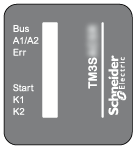

# TM3SAC5R / TM3SAC5RG Presentation

TM3SAC5R / TM3SAC5RG Presentation

Overview

The main characteristics of the TM3SAC5R (screw) and TM3SAC5RG (spring) modules are:

o1 channel or 2 channels

o24 Vdc

oRemovable screw or spring terminal

Main Characteristics

This table describes the main characteristics of the TM3SAC5R• module:

| Characteristic | | Value | |
| --- | --- | --- | --- |
| Number of safety input channels | | 2 | |
| Start mode | | Non-monitored | |
| Supply voltage | | 24 Vdc -15...+20 % | |
| Number of outputs | | 3 parallel relay outputs, stop category 0 | |
| Rated output voltage | | 24 Vdc / 230 Vac  6 A maximum per output path | |
| Connection type | TM3SAC5R | Removable screw terminal block | |
| TM3SAC5RG | Removable spring terminal block | |
| Weight | | 190 g (6.70 oz) | |

Associated Applications

This table defines the type and example of applications that can be associated to the TM3SAC5R• module:

| Application type | Application example |
| --- | --- |
| [1 channel application](../TM3_Safety_Description/TM3_Safety_Description-6.htm#XREF_D_SE_0038327_1) | oMonitoring 1 channel emergency stop circuits  oMonitoring 1 channel limit switches on protective guards |
| [2 channel application without short-circuit detection](../TM3_Safety_Description/TM3_Safety_Description-7.htm#XREF_D_SE_0039063_1) | oMonitoring 2 channel emergency stop circuits without short-circuit detection  oMonitoring 2 channel limit switches on protective guards without short-circuit detection |

Status LED

This figure shows the status LEDs:

This table provides the TM3SAC5R• module status LED indicators description:

| LED | Color | Status | Description |
| --- | --- | --- | --- |
| Bus | Green | Flashing | The module is receiving the 5 Vdc power supply from the TM3 Bus and the TM3 Bus is functioning. |
| A1/A2 | Green | On | +24 Vdc power supply provided to the module is in the voltage tolerance. |
| Flashing | TM3 Bus time-out: the safety operation is maintained. |
| Err | Red | On | +24 Vdc power supply provided to the module is out of the voltage tolerance. |
| Flashing | TM3 Bus time-out: the safety output is deactivated (off). |
| Start | Green | On | Start condition valid (The circuit between Y1-Y2 is closed). |
| K1 | Green | On | K1 relay energized (closed) |
| Flashing | Waiting for start condition |
| K2 | Green | On | K2 relay energized (closed) |
| Flashing | Waiting for start condition |

EIO0000003353.01

© 2019 Schneider Electric. All rights reserved.