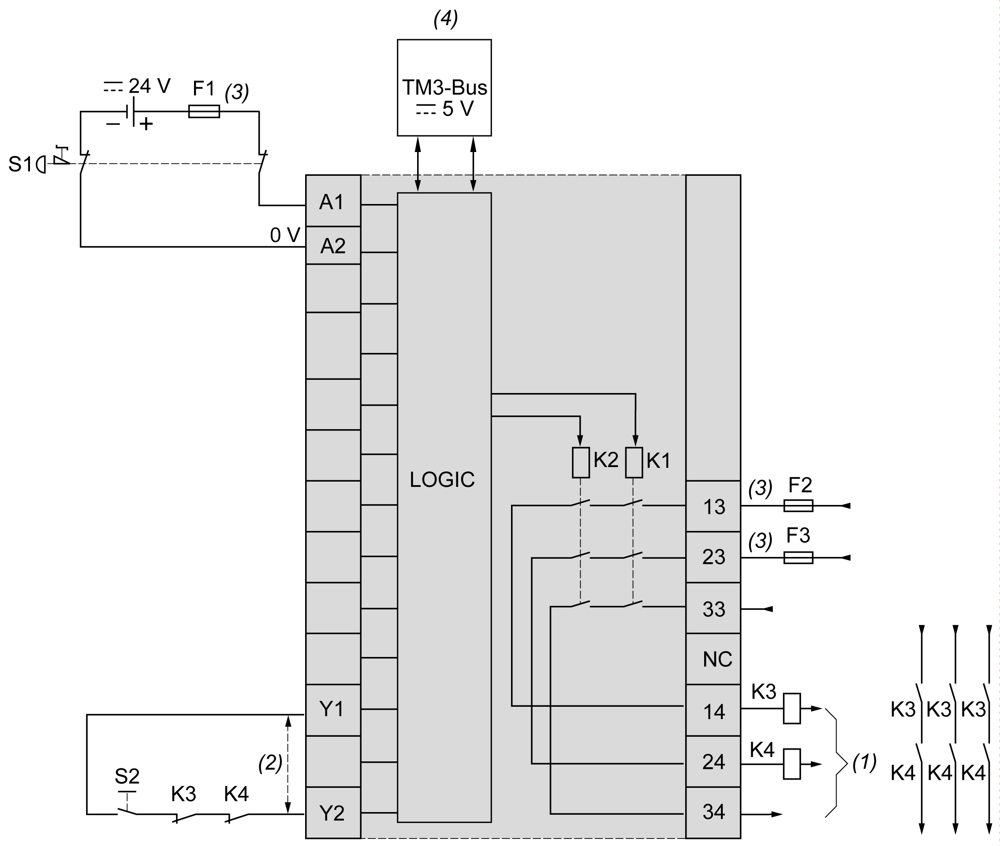

# TM3SAC5R / TM3SAC5RG Wiring Diagram

TM3SAC5R / TM3SAC5RG Wiring Diagram

Introduction

These safety modules have a built-in removable screw or spring terminal block for the connection of inputs and outputs.

Wiring Rules

See [Wiring Best Practices](../TM3_Installation/TM3_Installation-13.htm#XREF_D_SE_0037074_1).

The 24 Vdc power supply must be rated Protective Extra Low Voltage (PELV) or Safety Extra Low Voltage (SELV) and fulfill the IEC/EN 60204-1 requirements. These power supplies are isolated between the electrical input and output circuits of the power supply.

|  |
| --- |
| Warning_Color.gifWARNING |
| POTENTIAL OF OVERHEATING AND FIRE |
| oDo not connect the equipment directly to line voltage.  oUse only isolating PELV or SELV power supplies to supply power to the equipment. |
| Failure to follow these instructions can result in death, serious injury, or equipment damage. |

|  |
| --- |
| Warning_Color.gifWARNING |
| LOSS OF CONTROL |
| Place a properly rated fuse on the primary input power line and on the outputs, as described in the related documentation. |
| Failure to follow these instructions can result in death, serious injury, or equipment damage. |

Emergency Stop Wiring Diagram

Both the safety conditions and the start conditions must be valid before allowing the activation of outputs.

|  |
| --- |
| Warning_Color.gifWARNING |
| UNINTENDED EQUIPMENT OPERATION |
| Do not use either the monitored start or the non-monitored start as a safety function. |
| Failure to follow these instructions can result in death, serious injury, or equipment damage. |

This figure shows an example of emergency stop wiring to a TM3SAC5R• module:

S1: Emergency stop switch

S2: Start switch

(1): Safety outputs

(2): For automatic start, directly connect [Y1] and [Y2] terminals. For more information, refer to the TM3 Expansion Modules Programming Guide for your software platform.

(3): Fuses. Refer to electrical characteristics for fuse values.

(4): Non-safety related TM3 Bus communication with logic controller

|  |
| --- |
| Warning_Color.gifWARNING |
| UNINTENDED EQUIPMENT OPERATION |
| Do not use the data transferred over the TM3 Bus for any functional safety-related task(s). |
| Failure to follow these instructions can result in death, serious injury, or equipment damage. |

|  |
| --- |
| Warning_Color.gifWARNING |
| UNINTENDED EQUIPMENT OPERATION |
| Do not connect wires to unused terminals and/or terminals indicated as “No Connection (N.C.)”. |
| Failure to follow these instructions can result in death, serious injury, or equipment damage. |

EIO0000003353.01

© 2019 Schneider Electric. All rights reserved.