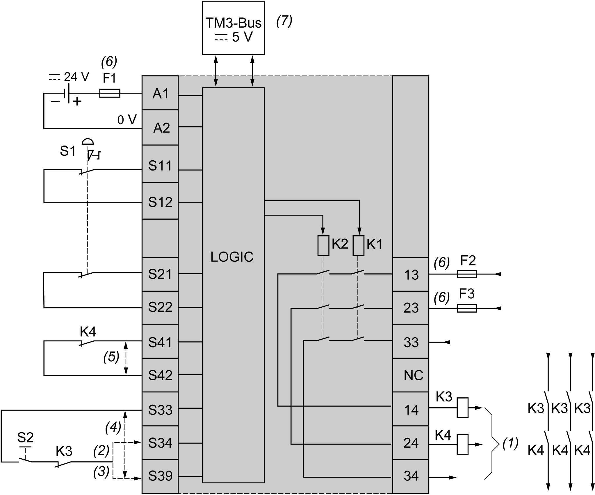
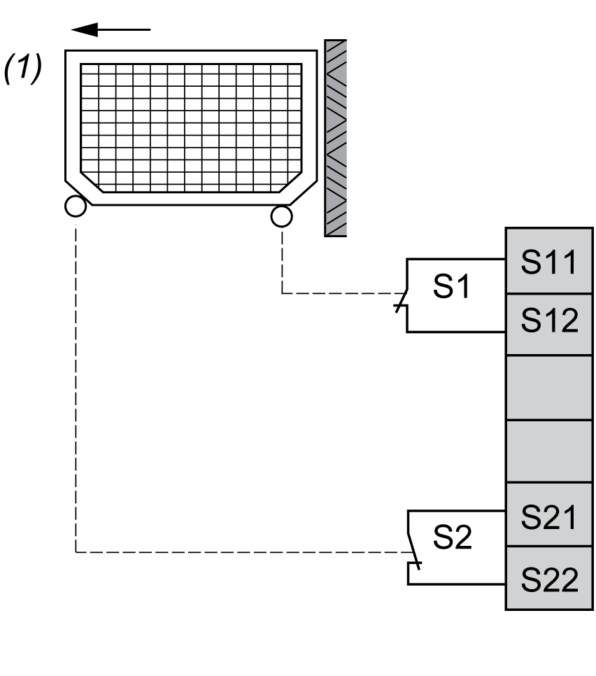
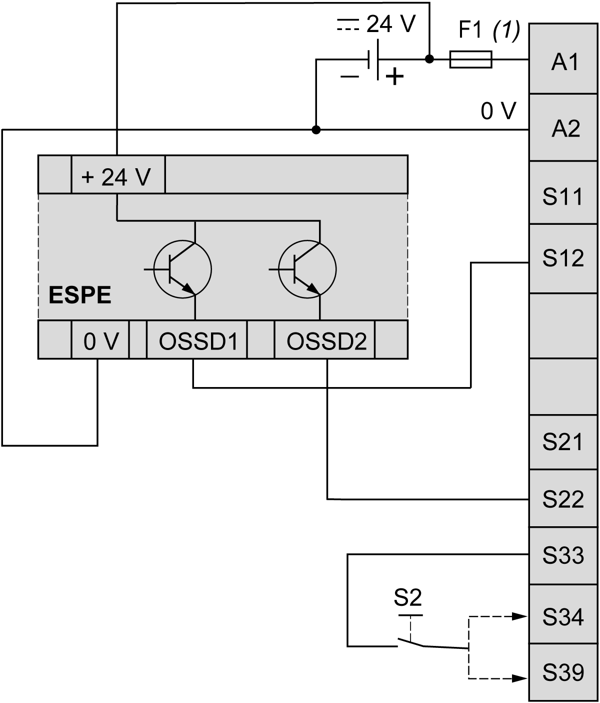

# TM3SAFL5R / TM3SAFL5RG Wiring Diagram

TM3SAFL5R / TM3SAFL5RG Wiring Diagram

Introduction

These safety modules have a built-in removable screw or spring terminal block for the connection of inputs and outputs.

Wiring Rules

See [Wiring Best Practices](../TM3_Installation/TM3_Installation-13.htm#XREF_D_SE_0037074_1).

The 24 Vdc power supply must be rated Protective Extra Low Voltage (PELV) or Safety Extra Low Voltage (SELV) and fulfill the IEC/EN 60204-1 requirements. These power supplies are isolated between the electrical input and output circuits of the power supply.

|  |
| --- |
| Warning_Color.gifWARNING |
| POTENTIAL OF OVERHEATING AND FIRE |
| oDo not connect the equipment directly to line voltage.  oUse only isolating PELV or SELV power supplies to supply power to the equipment. |
| Failure to follow these instructions can result in death, serious injury, or equipment damage. |

|  |
| --- |
| Warning_Color.gifWARNING |
| LOSS OF CONTROL |
| Place a properly rated fuse on the primary input power line and on the outputs, as described in the related documentation. |
| Failure to follow these instructions can result in death, serious injury, or equipment damage. |

Emergency Stop Wiring Diagram

Both the safety conditions and the start conditions must be valid before allowing the activation of outputs.

|  |
| --- |
| Warning_Color.gifWARNING |
| UNINTENDED EQUIPMENT OPERATION |
| Do not use either the monitored start or the non-monitored start as a safety function. |
| Failure to follow these instructions can result in death, serious injury, or equipment damage. |

This figure shows an example of emergency stop wiring to a TM3SAFL5R• module:

S1: Emergency stop switch

S2: Start switch

(1): Safety outputs

(2): Monitored start1

(3): Non-monitored start1

(4): For automatic start1, directly connect [S33] and [S39] terminals

(5): Second external device monitoring1 channel. Connect [S41] and [S42] terminals if not used.

(6): Fuses. Refer to electrical characteristics for fuse values.

(7): Non-safety related TM3 Bus communication with logic controller

1 For more information, refer to the TM3 Expansion Modules Programming Guide for your software platform.

|  |
| --- |
| Warning_Color.gifWARNING |
| UNINTENDED EQUIPMENT OPERATION |
| Do not use the data transferred over the TM3 Bus for any functional safety-related task(s). |
| Failure to follow these instructions can result in death, serious injury, or equipment damage. |

|  |
| --- |
| Warning_Color.gifWARNING |
| UNINTENDED EQUIPMENT OPERATION |
| Do not connect wires to unused terminals and/or terminals indicated as “No Connection (N.C.)”. |
| Failure to follow these instructions can result in death, serious injury, or equipment damage. |

Protective Guard Wiring

This figure shows an example of 2 channel protective guard wiring to the safety module inputs:

(1):   Protective guard

Electro-Sensitive Protective Equipment (ESPE) Wiring

This figure shows an example of ESPE (type 4 outputs, IEC/EN 61496-1) wiring to the safety module inputs:

(1):   Fuses. Refer to electrical characteristics for fuse values.

S2:   Start switch

NOTE: The ESPE must be supplied by the same PELV/SELV power supply as the safety module.

NOTE:

The outputs (OSSD) of ESPE may generate test pulses. Depending on duration and frequency of the pulses, the following behaviors may happen:

oElectromagnetic interference from the module relays.

oThe K1 and K2 relay diagnostics in the controller detects these pulses. To avoid this, a filter with a delay time of at least the pulse length can be defined in the controller.

oPulses longer than 1ms can cause the module outputs to turn off.

NOTE: The OSSD of ESPE typically generate test pulses with various duration and frequency.

oThis can cause the relays inside the module to make some noise.

oThe pulses might be visible in the K1/K2 diagnostic information in the PLC. To avoid this, a filter with appropriate delay time can be defined in the PLC.

oTest pulses longer than 1 ms can cause the outputs of the module to switch off.

EIO0000003353.01

© 2019 Schneider Electric. All rights reserved.