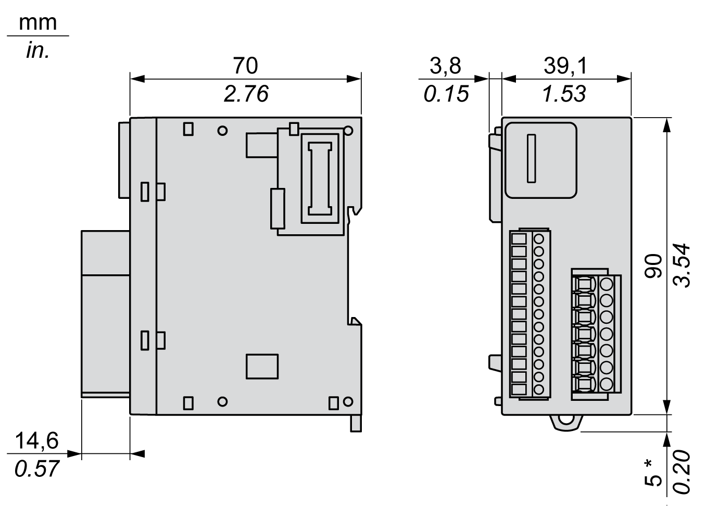

# TM3SAK6R / TM3SAK6RG Characteristics

TM3SAK6R / TM3SAK6RG Characteristics

Introduction

This section provides a description of the characteristics of TM3SAK6R / TM3SAK6RG safety modules.

See also [Environmental Characteristics](../TM3_Installation/TM3_Installation-3.htm#XREF_D_SE_0037064_1).

|  |
| --- |
| Warning_Color.gifWARNING |
| UNINTENDED EQUIPMENT OPERATION |
| Do not exceed any of the rated values specified in the environmental and electrical characteristics tables. |
| Failure to follow these instructions can result in death, serious injury, or equipment damage. |

Dimensions

This diagram shows the external dimensions of the TM3SAK6R / TM3SAK6RG safety modules:

\*   8.5 mm (0.33 in.) when the clamp is pulled out.

Safety-related

The TM3SAK6R• module is a safety module for monitoring emergency stop and limit switches on protective guards, safety light curtains, and safety-mats according to ISO/EN 13849, IEC/EN 62061, IEC/EN 61058. The module has these safety-related characteristics:

| Characteristic | Value | Designed to specification |
| --- | --- | --- |
| Safety integrity level (SIL) | 3 | IEC/EN 61508-1:2010 |
| Safety integrity level claim limit (SILCL) | 3 | IEC/EN 62061:2005 |
| Safe failure fraction (SFF) | 95 % | IEC/EN 61508-1:2010 |
| Hardware fault tolerance (HFT) | 1 | IEC/EN 61508-1:2010 |
| Type | A | IEC/EN 61508-1:2010 |
| Mode of operation | High demand mode | IEC/EN 61508-1:2010 |
| Probability of dangerous failures per hour (PFHd) | 30 \* 10-9 / h (1) | IEC/EN 61508-1:2010 |
| 5 \* 10-9 / h (2) |
| Mean time to dangerous failure (MTTFd) | 85 years (1) | ISO/EN 13849-1:2008 |
| 500 years (2) |
| Performance level (PL) category (cat.) | PL e. cat. 4 | ISO/EN 13849-1:2008 |
| Diagnostic coverage (DC) | 95 % | ISO/EN 13849-1:2008 |
| Lifetime | 20 years | – |
| Response time | 20 ms | – |
| Proof test interval (PTI) | None | – |
| Stop category | 0 | IEC/EN 60204-1 |
| Start | Manual or automatic | – |
| Paths | • 3 enabling paths  • 1 signaling path | – |
| Feedback | Feedback loop to monitor external contactors. | – |
| Defined safe state | The TM3 safety modules are in the defined safe state when their outputs are off (internal relays are not energized; output path is open). | – |
| NOTE: These modules contain electromechanical relays, so actual MTTFd and PFHd values vary depending on the application load and duty cycle.  (1)   60 operation cycles per hour at DC-13 24 Vdc 1 A  (2)   1 operation cycle per hour at DC-13 24 Vdc 4 A | | |

Power Supply

This table describes the power supply characteristics of the TM3 safety module:

| Characteristic | | Value |
| --- | --- | --- |
| Supply voltage | IEC 60038 | 24 Vdc -15...+20 % |
| External fuse protection (maximum) | | 4 A slow blow (class gG) |
| Power consumption | 24 Vdc supply voltage | 3.6 W |
| TM3 Bus (5 Vdc) | 0.2 W |

Control Circuit

This table describes the control circuit characteristics of the TM3 safety module:

| Characteristic | | Value |
| --- | --- | --- |
| Input voltage (high) (1) | Minimum | 19.6 Vdc |
| Nominal | 24 Vdc |
| Maximum | 28.8 Vdc |
| Input voltage (low) (1) | Minimum | 0 Vdc |
| Nominal | 0 Vdc |
| Maximum | 2 Vdc |
| Input current (high) (1) | Nominal | 35 mA |
| Maximum | 80 mA |
| Input current (low) (1) | Nominal | 0 mA |
| Maximum output current from control circuit terminals: S11, S31, [S22](../TM3_Safety_Description/TM3_Safety_Description-3.htm#XREF_D_SE_0037059_11) | | 100 mA |
| Nominal voltage at the pins | | 24 Vdc |
| Response time | | ≤ 20 ms |
| Delay | On | ≤ 100 ms |
| Restart | ≤ 300 ms |
| (1)    At terminal S12, S32 when externally supplied | | |

Output Circuit

This table describes the output circuit characteristics of the TM3 safety module:

| Characteristic | | Value |
| --- | --- | --- |
| Maximum switching current of each output | AC-15: 230 Vac | 5 A |
| DC-13: 24 Vdc | 4 A |
| Minimum switching voltage and current (new contact never used with higher loads) | | 17 V, 10 mA |
| Maximum current | Per output path | 6 A |
| Sum of current in all output paths | ≤ 18 A |
| External fuse protection (maximum) | Slow blow (class gG) fuse | 4 A |
| Fast blow fuse | 6 A |
| Maximum switching operations | | 107 |

EIO0000003353.01

© 2019 Schneider Electric. All rights reserved.