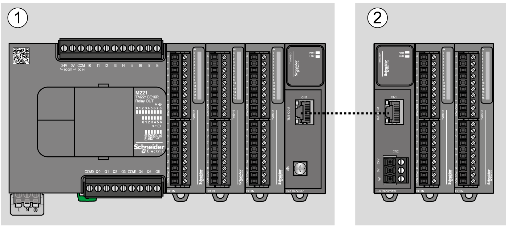
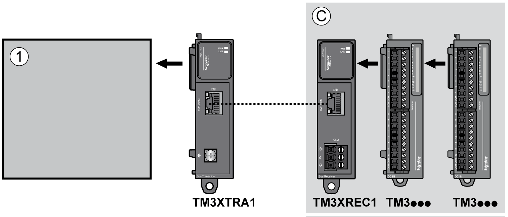

# General Description

## Introduction

The TM3 transmitter expansion module is equipped with:

* 1 front connector RJ45
* 1 screw for functional ground connection
* 2 status LEDs (link and power)

The TM3 receiver expansion module is equipped with:

* 1 front connector RJ45
* 1 connector for power supply
* 2 status LEDs (link and power)

The TM3 transmitter module is connected to the logic controller through the TM3 bus. It is connected using a connector at the left side of the module. The TM3 transmitter expansion module is the last physical module of the local configuration (there is no bus connector on the right-hand side of the module).

The TM3 receiver module is connected through the front connector RJ45 to the TM3 transmitter module with an appropriate cable (refer to [Accessories](Accessories-94ABD07B.html)).

## TM3 Transmitter and Receiver Modules

The following table shows the TM3 [transmitter and receiver expansion modules](D-SE-0025780.html#D-SE-0025780):

| Reference | Description | Terminal Type / Pitch |
| --- | --- | --- |
| [TM3XTRA1](D-SE-0025793.html#D-SE-0025793) | Data transmitter module for remote I/O | 1 front connector RJ-45  1 screw for functional ground connection |
| [TM3XREC1](D-SE-0025813.html#D-SE-0025813) | Data receiver module for remote I/O | 1 front connector RJ-45  Power supply connector / 5.08 mm |

## Implementation of TM3 Transmitter and Receiver Modules

The following figure defines the system divided into a local configuration and remote configuration (M221 example):

**1** Local configuration

**2** Remote configuration

The following figure represents the components of a remote configuration:

**1** Controller and modules

**C** Expansion modules (7 maximum)

NOTE: Transmitter and receiver modules does not count in the maximum number of expansion modules.

NOTE: You cannot use TM2 modules in configurations that include the TM3 transmitter and receiver modules.

EIO0000003143.02