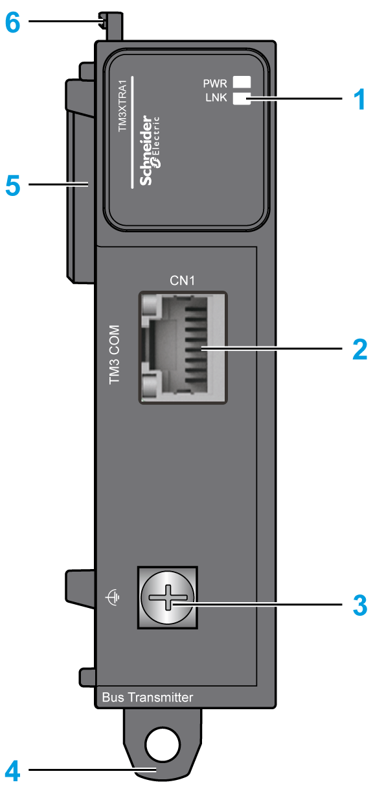
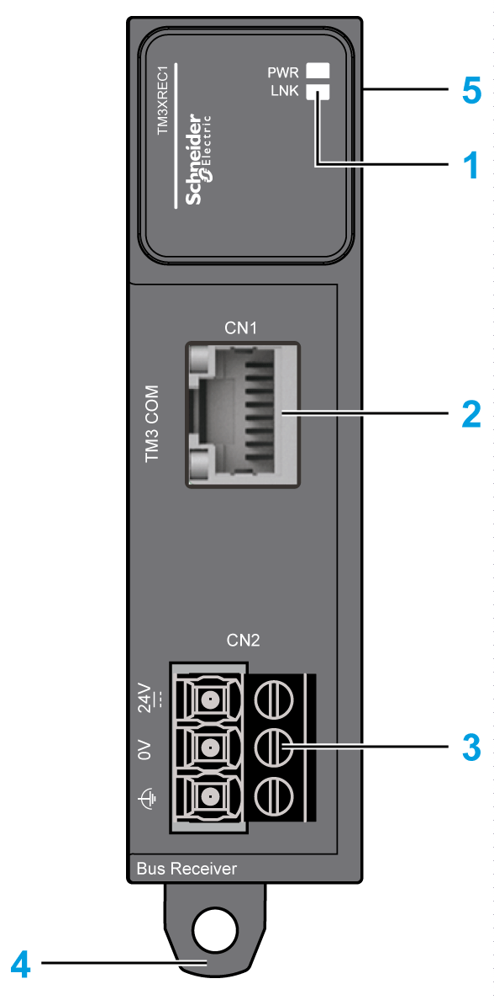

# Physical Description

## Introduction

This section describes the physical characteristics of the TM3 transmitter and receiver modules.

## TM3 Transmitter Modules

The following figure shows the parts of the TM3XTRA1 transmitter expansion module:

This table describes the main elements of the TM3XTRA1 transmitter expansion module shown above:

| N° | Description | Refer to |
| --- | --- | --- |
| 1 | LEDs for displaying the link activity and power supply status | – |
| 2 | TM3 bus port | – |
| 3 | Screw for functional ground connection | [Grounding](D-SE-0032379.html#D-SE-0032379) |
| 4 | Clip-on lock for 35 mm (1.38 in.) DIN rail | [Top Hat Section Rail (DIN rail)](TopHatSectionRailDINRail-8CC2B316.html) |
| 5 | Expansion connector for TM3 I/O bus (left side only) | – |
| 6 | Locking device for attachment to the previous module | – |

NOTE: The transmitter must be the last module in the local I/O expansion configuration.

## TM3 Receiver Modules

The following figure shows the parts of the TM3XREC1 receiver expansion module:

This table describes the main elements of the TM3XREC1 receiver expansion module shown above:

| N° | Description | Refer to |
| --- | --- | --- |
| 1 | LEDs for displaying the link activity and power supply status | – |
| 2 | TM3 bus port | – |
| 3 | Power supply screw terminal block | [Power Supply Wiring diagram](D-SE-0025816.html#D-SE-0025816__D-SE-0025816.10) |
| 4 | Clip-on lock for 35 mm (1.38 in.) DIN-rail | [Top Hat Section Rail (DIN rail)](TopHatSectionRailDINRail-8CC2B316.html) |
| 5 | Expansion connector for TM3 I/O bus (right side only) | – |

EIO0000003143.02