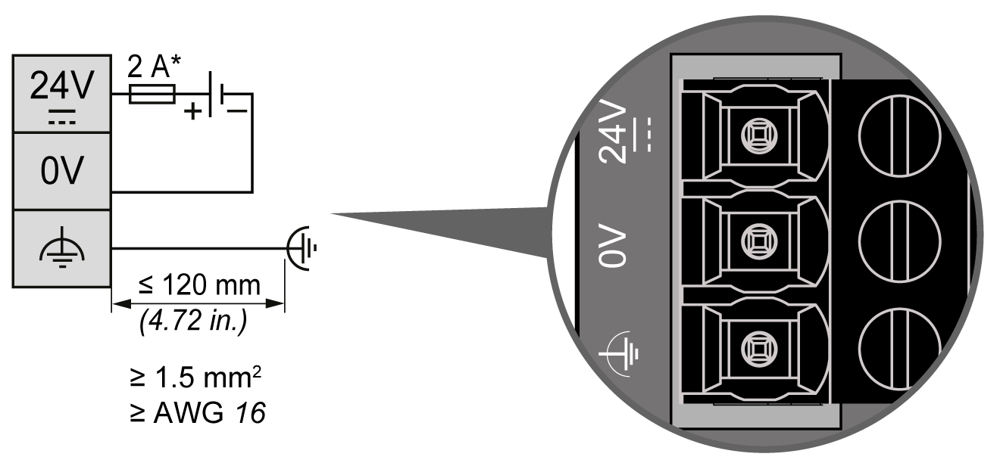

# DC Power Supply Characteristics

## Overview

The TM3 transmitter and receiver modules require a power supply with a nominal voltage of 24 Vdc. The 24 Vdc power supply must be rated Protective Extra Low Voltage (PELV) according to IEC 61140. This power supply is isolated between the electrical input and output circuits of the power supply.

| WARNING | |
| --- | --- |
|  | POTENTIAL OF OVERHEATING AND FIRE  * Do not connect the equipment directly to line voltage. * Use only isolating PELV power supplies and circuits to supply power to the equipment1.  Failure to follow these instructions can result in death, serious injury, or equipment damage. |

1For compliance to UL (Underwriters Laboratories) requirements, the power supply must also conform to the various criteria of NEC Class 2, and be inherently current limited to a maximum power output availability of less than 100 VA (approximately 4 A at nominal voltage), or not inherently limited but with an additional protection device such as a circuit breaker or fuse meeting the requirements of clause 9.4 Limited-energy circuit of UL 61010-1. In all cases, the current limit should never exceed that of the electric characteristics and wiring diagrams for the equipment described in the present documentation. In all cases, the power supply must be grounded, and you must separate Class 2 circuits from other circuits. If the indicated rating of the electrical characteristics or wiring diagrams are greater than the specified current limit, multiple Class 2 power supplies may be used.

## DC Power Supply Wiring Diagram

This section applies **only** to TM3XREC1 expansion modules. It is not valid for TM3XTRA1 expansion modules.

The following figure shows the wiring of the DC power supply:

**\*** Type T fuse

The functional ground cable requires a cross-section of at least 1.5 mm2 (AWG 16) and a maximum length of 120 mm (4.72 in.).

## DC Power Supply Rules

If 2 separate power supplies are used for the receiver and the controller, the TM3 receiver module power supply must be switched on before the controller power supply. If not, the TM3 bus does not start, and all modules are in Reset state (all outputs are forced to 0).

When the TM3 receiver module and the controller are supplied by the same power supply, the whole configuration starts together properly.

If only the TM3 receiver module is powered (controller not supplied), the TM3 modules after the TM3 receiver module are in Reset state (all outputs are forced to 0).

NOTE: You must connect the functional ground (FE) via the power supply, and the functional or protective ground of the power supply to the same equipotential functional ground of the controller and TM3 transmitter module. Without the functional ground connection, the TM3 transmitter module may not establish communication with the TM3 receiver module, or possibly damage your equipment.

| NOTICE | |
| --- | --- |
|  | INOPERABLE EQUIPMENT  * Ensure that the functional ground power supply connection of the TM3 receiver module is securely connected to the functional ground of the controller system. * Monitor the status of the TM3 bus within your application to determine the correct behavior of TM3 bus in case of disconnection from the functional ground.  Failure to follow these instructions can result in equipment damage. |

EIO0000003143.02