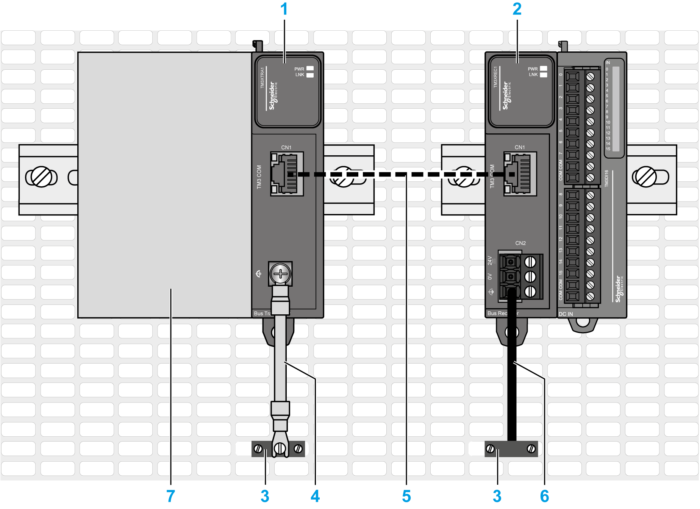
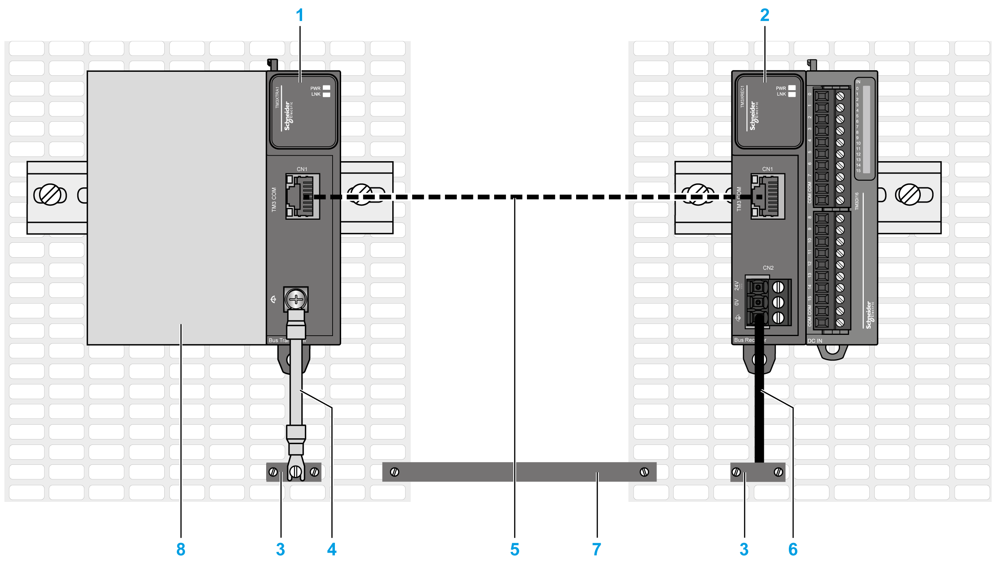

# Grounding the TM3 Transmitter and Receiver Modules

## Overview

Due to the effects of electromagnetic interference, cables carrying fast I/O, analog I/O, and the fieldbus communication signals must be shielded.

| WARNING | |
| --- | --- |
|  | UNINTENDED EQUIPMENT OPERATION  * Use shielded cables for all fast I/O, analog I/O, and communication signals. * Ground cable shields for all fast I/O, analog I/O, and communication signals at a single point1. * Route communications and I/O cables separately from power cables.  Failure to follow these instructions can result in death, serious injury, or equipment damage. |

1Multipoint grounding is permissible if connections are made to an equipotential ground plane dimensioned to help avoid cable shield damage in the event of power system short-circuit currents.

The  use of shielded cables requires compliance with the following wiring rules:

* For protective earth ground connections (PE), metal conduit or ducting can be used for part of the shielding length, provided there is no break in the continuity of the ground connections. For functional earth ground (FE), the shielding is intended to attenuate electromagnetic interference and the shielding must be continuous for the length of the cable. If the purpose is both functional and protective, as is often the case for communication cables, the cable must have continuous shielding.
* Wherever possible, keep cables carrying one type of signal separate from the cables carrying other types of signals or power.

## Shielded Cables Connections

Cables carrying fast I/O, analog I/O, and the fieldbus communication signals must be shielded. The shielding must be securely connected to ground. Fast I/O and analog I/O shields may be connected either to the functional earth ground (FE) or to the protective earth ground (PE) of your TM3 expansion module. The fieldbus communication cable shields must be connected to the protective earth ground (PE) with a connecting clamp secured to the conductive backplane of your installation.

| WARNING | |
| --- | --- |
|  | ACCIDENTAL DISCONNECTION FROM PROTECTIVE GROUND (PE)  * Do not use the Grounding Bar to provide a protective earth ground (PE). * Use the Grounding Bar only to provide a functional earth ground (FE).  Failure to follow these instructions can result in death, serious injury, or equipment damage. |

## Protective Earth Ground (PE) on the Backplane

The protective earth ground (PE) is connected to the conductive backplane by a heavy-duty wire, usually a braided copper cable with the maximum allowable cable section.

## Functional Earth Ground (FE) on the DIN Rail

The DIN Rail for your TM3 system is common with the functional earth ground (FE) plane and must be mounted on a conductive backplane.

| WARNING | |
| --- | --- |
|  | UNINTENDED EQUIPMENT OPERATION  Connect the DIN rail to the functional earth ground (FE) of your installation.  Failure to follow these instructions can result in death, serious injury, or equipment damage. |

## Functional Earth Ground (FE) Connections

To connect the functional earth ground (FE):

| Step | Action |
| --- | --- |
| 1 | Connect the functional ground cable from the TM3XTRA1 functional ground screw to the conductive backplane.  The following table shows the characteristics of the screw to be used with the provided functional ground cable:    NOTE: You must connect the functional ground (FE) of the TM3 transmitter module to the same functional ground connected to your controller. Without the functional ground connection, the TM3 transmitter module may not establish communication with the TM3 receiver module.   | WARNING | | | --- | --- | |  | UNINTENDED EQUIPMENT OPERATION  * Ensure that the functional ground cable is securely connected between the functional ground screw of the TM3 transmitter module and the functional ground of the controller. * Monitor the status of the TM3 bus within your application to determine the correct behavior of the TM3 bus in case of disconnection from the functional ground of the TM3 transmitter module.  Failure to follow these instructions can result in death, serious injury, or equipment damage. |   Applying torque above the limit may damage the terminal screw or threads.   | NOTICE | | | --- | --- | |  | INOPERABLE EQUIPMENT  Do not tighten screw terminals beyond the specified maximum torque (N•m / lb-in.).  Failure to follow these instructions can result in equipment damage. | |
| 2 | Connect the functional ground of the TM3XREC1 power supply connector to the conductive backplane.  The functional ground cable requires a cross-section of at least 1.5 mm2 (AWG 16) and a maximum length of 120 mm (4.72 in.). |

This figure presents grounding with a common ground plane:

**(1)** TM3XTRA1

**(2)** TM3XREC1

**(3)** Functional earth ground (FE)

**(4)** Provided functional ground cable

**(5)** ACTPC6FULS••WE cable

**(6)** User-supplied grounding cable

**(7)** A controller, bus coupler or expansion module

This figure presents grounding with separated ground planes:

**(1)** TM3XTRA1

**(2)** TM3XREC1

**(3)** Functional earth ground (FE)

**(4)** Provided functional ground cable

**(5)** ACTPC6FULS••WE cable

**(6)** User-supplied grounding cable

**(7)** Equipotential ground connection

**(8)** A controller, bus coupler or expansion module

EIO0000003143.02