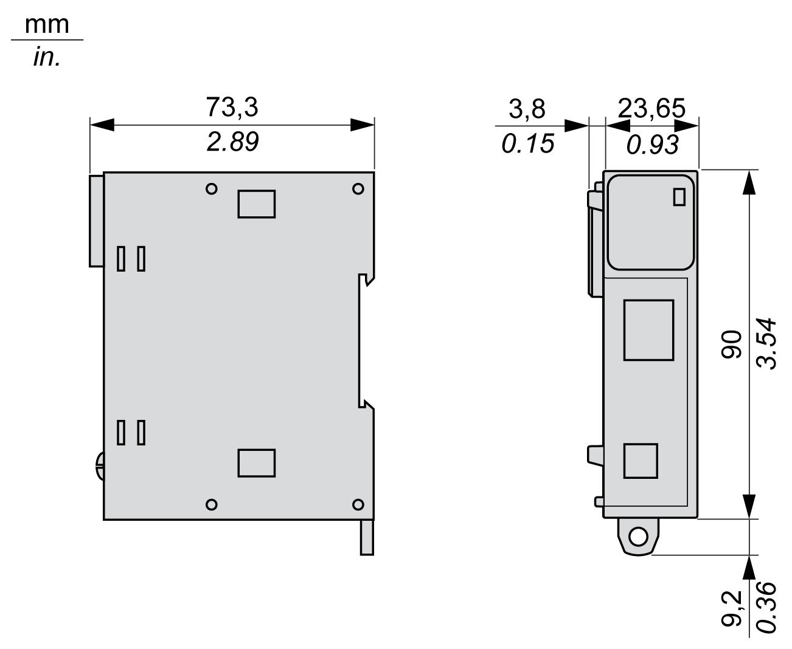

# TM3XTRA1 Characteristics

## Introduction

This section provides a description of the characteristics of the TM3XTRA1 expansion module.

See also [Environmental Characteristics](D-SE-0038699.html#D-SE-0038699).

| WARNING | |
| --- | --- |
|  | UNINTENDED EQUIPMENT OPERATION  Do not exceed any of the rated values specified in the environmental and electrical characteristics tables.  Failure to follow these instructions can result in death, serious injury, or equipment damage. |

## Dimensions

The following diagrams show the dimensions for the TM3XTRA1 expansion module:

EIO0000003143.02