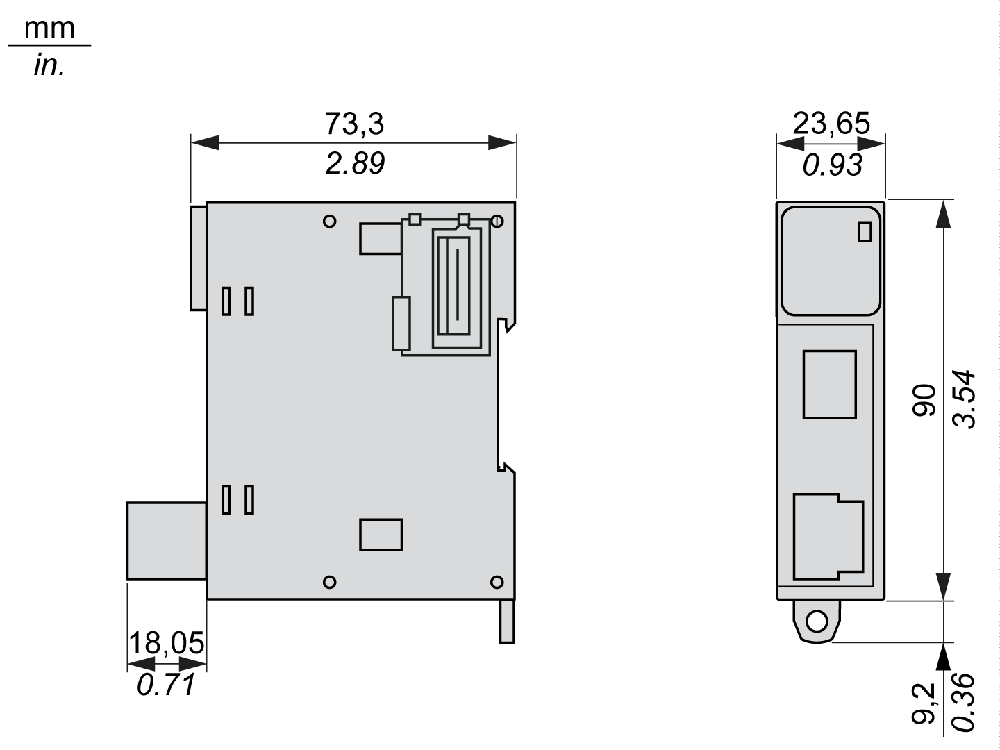

# TM3XREC1 Characteristics

## Introduction

This section provides a description of the characteristics of the TM3XREC1 module.

See also [Environmental Characteristics](D-SE-0038699.html#D-SE-0038699).

| DANGER | |
| --- | --- |
|  | FIRE HAZARD  Use only the correct wire sizes for the maximum current capacity of the I/O channels and power supplies.  Failure to follow these instructions will result in death or serious injury. |

| WARNING | |
| --- | --- |
|  | UNINTENDED EQUIPMENT OPERATION  Do not exceed any of the rated values specified in the environmental and electrical characteristics tables.  Failure to follow these instructions can result in death, serious injury, or equipment damage. |

## Dimensions

The following diagrams show the dimensions for the TM3XREC1 expansion module:

EIO0000003143.02