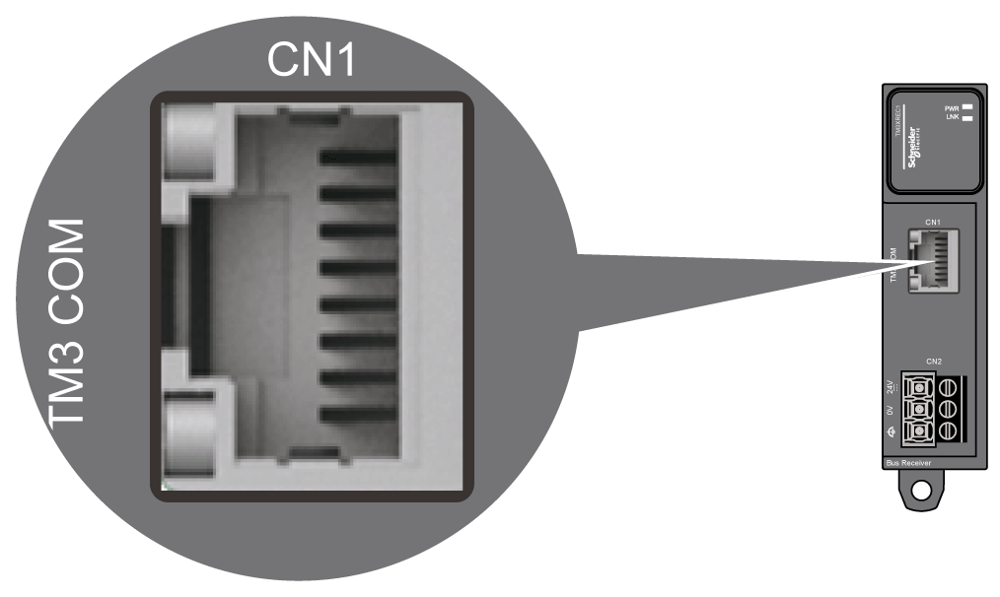

# TM3XREC1 Wiring Diagram

## Wiring Rules

See [Wiring Best Practices](D-SE-0026685.html#D-SE-0026685).

## TM3 Bus Port

The TM3XREC1 is equipped with an RJ45 connector.

## DC Power Supply Wiring Diagram

See [DC Power Supply Characteristics](DCPowerSupplyRequirements-631478BD.html).

EIO0000003143.02