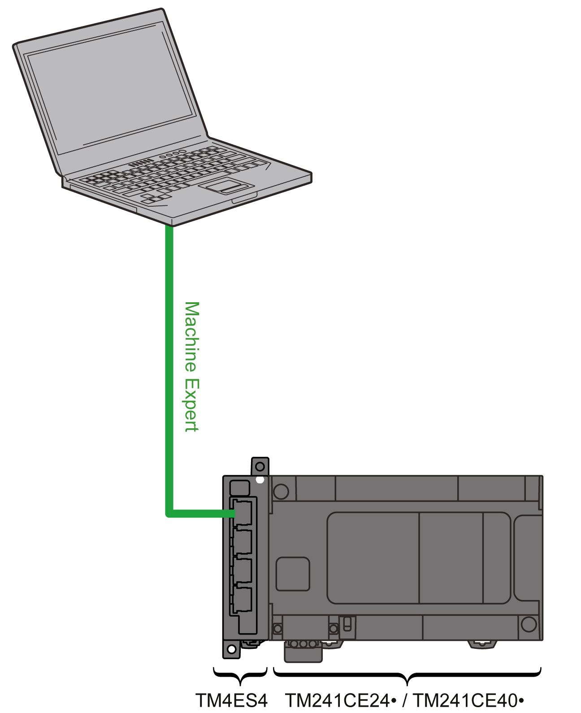

# Connecting the Controller to a PC

## Overview

To transfer, run, and monitor the applications, connect the controller to a computer that has EcoStruxure Machine Expert installed. Use either a USB cable or an Ethernet connection (for those references that support an Ethernet port).

| NOTICE | |
| --- | --- |
|  | INOPERABLE EQUIPMENT  Always connect the communication cable to the PC before connecting it to the controller.  Failure to follow these instructions can result in equipment damage. |

## Ethernet Port Connection

You can connect the controller to a PC using an Ethernet cable.

To connect the controller to the PC, do the following:

| Step | Action |
| --- | --- |
| 1 | Connect your Ethernet cable to the PC. |
| 2 | Connect your Ethernet cable to a free Ethernet port on the TM4ES4 expansion module. |

EIO0000003149.04