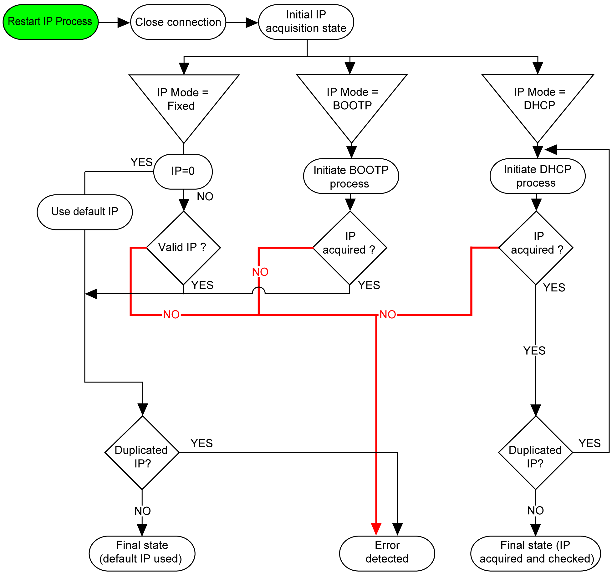
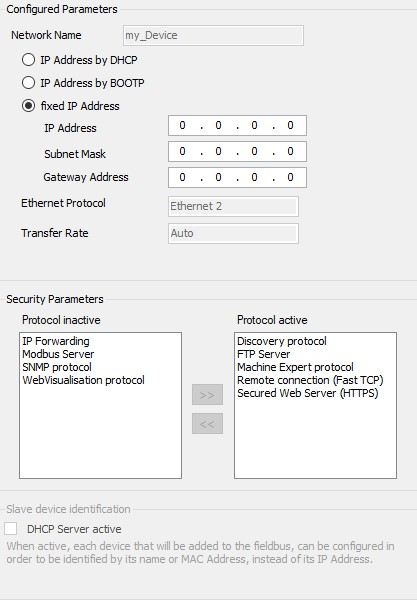

# IP Address Configuration

## Introduction

There are different ways to assign the IP address of the module:

* address assignment by DHCP server
* address assignment by BOOTP server
* fixed IP address
* [post configuration file](../../../../../api/crossBook?lang=en-US&virtualBookName=m241prg&topicID=D_SE_0010304). If a post configuration file exits, this assignment method has priority over the others.

The IP address can also be changed dynamically through the:

* Communication Settings [tab](../../../../../api/crossBook?lang=en-US&virtualBookName=m241prg&topicID=D_SE_0035606)
* changeIPAddress [function block](../../../../../api/crossBook?lang=en-US&virtualBookName=m241prg&topicID=D_SE_0037016)

NOTE: If the attempted addressing method is unsuccessful, the link uses a [default IP address](#D-SE-0036078__D-SE-0036078.4) derived from the MAC address.

Carefully manage the IP addresses because each device on the network requires a unique address. Having multiple devices with the same IP address can cause unintended operation of your network and associated equipment.

| WARNING | |
| --- | --- |
|  | UNINTENDED EQUIPMENT OPERATION  * Verify that there is only one master controller configured on the network or remote link. * Verify that all devices have unique addresses. * Obtain your IP address from your system administrator. * Confirm that the IP address of the device is unique before placing the system into service. * Do not assign the same IP address to any other equipment on the network. * Update the IP address after cloning any application that includes Ethernet communications to a unique address.  Failure to follow these instructions can result in death, serious injury, or equipment damage. |

NOTE: Verify that your system administrator maintains a record of all assigned IP addresses on the network and subnetwork, and inform the system administrator of all configuration changes performed.

## Address Management

The different types of address systems for the controller are shown in the following diagram:

NOTE: If a device programmed to use the DHCP or BOOTP addressing methods is unable to contact its respective server, the module uses the default IP address. However, the process is repeated until the respective server is reached and an IP address is acquired.

## Ethernet Configuration

In the Devices tree, double-click TM4ES4:

NOTE:

* If you are in offline mode, you see the Configured Parameters window (displayed above). You can edit the parameters.
* If you are in online mode, you see the Configured Parameters and Current Settings windows. You cannot edit the parameters.

This table describes the configured parameters:

| Configured Parameters | | Description |
| --- | --- | --- |
| Network Name | | Used as device name to retrieve IP address through DHCP, maximum 15 characters. |
| IP Address by DHCP | | IP address is obtained via DHCP. |
| IP Address by BOOTP | | IP address is obtained via BOOTP. |
| Fixed IP Address | | IP address, Subnet mask and Gateway Address are defined by the user. |
| Ethernet Protocol | | Protocol type used: Ethernet 2 |
| Transfer Rate | | Transfer rate and direction on the bus are automatically configured. |

**Default IP Address**

The IP address by default is 11.11.x.x.

The last 2 fields in the default IP address are composed of the decimal equivalent of the last 2 hexadecimal bytes of the MAC address of the module.

The MAC address of the module can be retrieved at the bottom of the front face of the module.

The default subnet mask is 255.0.0.0.

NOTE: A MAC address is always written in hexadecimal format, and an IP address in decimal format. You must convert the MAC address to decimal format.

Example: If the MAC address is 00.80.F4.01.**80.F2**, the default IP address is 11.11.**128.242**.

NOTE: To take into account the new IP address after the download of a project, reboot the controller by doing a power cycle.

**Subnet Mask**

The subnet mask is used to address several physical networks with a single network address. The mask is used to separate the subnetwork and the device address in the host ID.

The subnet address is obtained by retaining the bits of the IP address that correspond to the positions of the mask containing 1, and replacing the others with 0.

Conversely, the subnet address of the host device is obtained by retaining the bits of the IP address that correspond to the positions of the mask containing 0, and replacing the others with 1.

Example of a subnet address:

|  |  |  |  |  |
| --- | --- | --- | --- | --- |
| IP address | 192 (11000000) | 1 (00000001) | 17 (00010001) | 11 (00001011) |
| Subnet mask | 255 (11111111) | 255 (11111111) | 240 (11110000) | 0 (00000000) |
| Subnet address | 192 (11000000) | 1 (00000001) | 16 (00010000) | 0 (00000000) |

NOTE: The device does not communicate on its subnetwork when there is no gateway.

**Gateway Address**

The gateway allows a message to be routed to a device which is not on the current network.

If there is no gateway, the gateway address is 0.0.0.0.

**Security Parameters**

This table describes the different security parameters:

| Security Parameters | Description | Default settings |
| --- | --- | --- |
| Discovery protocol | This parameter activates/deactivates Discovery protocol. When deactivated, Discovery requests are ignored. | Active |
| FTP Server | This parameter activates/deactivates the FTP Server of the controller. When deactivated, FTP requests are ignored. | Active |
| IP Forwarding | This parameter activates/deactivates the IP Forwarding service of the controller. When deactivated, devices on the device network are no longer accessible from the control network (Web pages, DTM).  NOTE: This parameter is only available on the Ethernet\_1 network. | Inactive |
| Machine Expert protocol | This parameter activates/deactivates the Machine Expert protocol on Ethernet interfaces. When deactivated, Machine Expert requests from any device are rejected, including those from the UDP or TCP connection. This means that no connection is possible on Ethernet from a programming PC, from an HMI target that wants to exchange variables with this controller, from an OPC server, or from Controller Assistant. | Active |
| Modbus Server | This parameter activates/deactivates the Modbus Server of the controller. When deactivated, Modbus requests to the controller are ignored. | Inactive |
| SNMP protocol | This parameter activates/deactivates the SNMP server of the controller. When deactivated, SNMP requests are ignored. | Inactive |
| Remote connection (Fast TCP) | This parameter activates/deactivates the remote connection. When deactivated, Fast TCP requests are ignored. | Active |
| Secured Web Server (HTTPS) | This parameter activates/deactivates the Secured Web server of the controller. When deactivated, HTTPS requests to the controller Secured Web server are ignored. | Active |
| WebVisualisation protocol | This parameter activates/deactivates the WebVisualisation pages of the controller. When deactivated, HTTP requests to the controller WebVisualisation protocol are ignored. | Inactive |

**Device Identification**

When DHCP Server active is selected, devices added to the fieldbus can be configured to be identified by their name or MAC address, instead of their IP address. Refer to [DHCP Server](../../../../../api/crossBook?lang=en-US&virtualBookName=m241prg&topicID=D_SE_0061164).

EIO0000003149.04