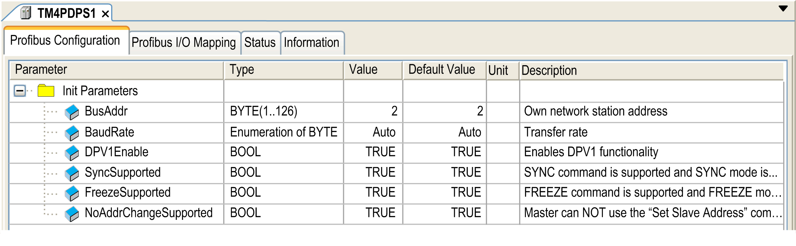

# Configure the PROFIBUS DP Slave Module

## PROFIBUS DP Slave Module Configuration

In the Devices tree, double-click My Controller > COM\_Bus > TM4PDPS1:

The following parameters are provided in the Profibus Configuration tab:

| Parameter | Value | Default Value | Description |
| --- | --- | --- | --- |
| BusAddr | 1...126 | 2 | PROFIBUS DP slave address  The address 126 is reserved. |
| BaudRate (kBaud) | 9.6  19.2  45.45  93.75  187.5  500  1500  3000  6000  12000  Auto | Auto | PROFIBUS transmission rate |
| DPV1Enable | TRUE  FALSE | TRUE | TRUE indicates that the [Profibus DPV1 functions for acyclic communication](D-SE-0036168.html#D-SE-0036168) is enabled. |
| SyncSupported | TRUE  FALSE | TRUE | TRUE indicates that the Synchronization mode is enabled. |
| FreezeSupported | TRUE  FALSE | TRUE | TRUE indicates that the Freeze mode is enabled. |
| NoAddrChangeSupported | TRUE  FALSE | TRUE | TRUE indicates that the PROFIBUS master cannot change the address. |

EIO0000003149.04