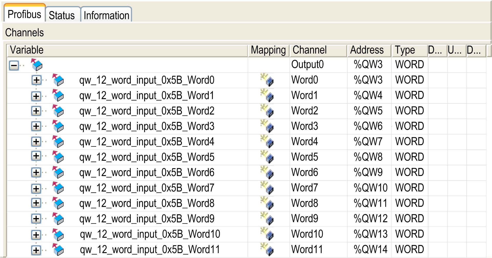

# I/O Cyclic Exchange

## Introduction

In order to exchange input / output data between the PROFIBUS DP slave module and the PROFIBUS master in a cyclic way, define the variables in the Profibus-Modules I/O Mapping tab.

The `%IW` addresses of the controller are the output values supplied by the PROFIBUS DP master.

The `%QW` addresses of the controller are applied to the input of the PROFIBUS DP master.

NOTE: When you use the PROFIBUS module TM4PDPS1, it is mandatory to:

* configure a dedicated PROFIBUS task without watchdog (do not use the MAST task)
* assign the dedicated PROFIBUS task a lower priority than the MAST task (for example, if the MAST task has a priority value 1, the TaskProfibus must have a priority value 10)
* not set the PROFIBUS task cycle time faster than 10 ms. The typical cycle time of the bus cycle task is 10 ms.

For more information about PROFIBUS task configuration, refer to the chapter [PROFIBUS – Bus Cycle Task](../../../../../api/crossBook?lang=en-US&virtualBookName=CODESYS_PROFIBUS&topicID=47a034276d66083312239d7d02f4ffae).

## I/O Mapping Table Creation

To create your I/O mapping table for the TM4PDPS1, proceed as follows:

| Step | Action |
| --- | --- |
| 1 | Select the Devices & Modules tab in the Hardware Catalog and click Communication. |
| 2 | Expand the Profibus node, choose the I/O device to add and drag-and-drop it onto TM4PDPS1.  **Result:** The module is added to My Controller > COM\_Bus > TM4PDPS1 area of the Devices tree. |

The variables for the exchange are automatically created in the `%IWx` and `%QWx` of the Profibus I/O Mapping tab. Double-click the I/O device you added to access this screen:

The tabs of the configuration window are described in the table below:

| Tab Name | Description |
| --- | --- |
| Profibus I/O Mapping | This tab contains the variables for data exchange. |
| Status | This tab provides [diagnostic information](D-SE-0036169.html#D-SE-0036169). |
| Information | This tab provides further information on the selected input or output module. |

## PROFIBUS Virtual I/O Behavior

The table describes the status of the PROFIBUS I/O depending on:

* the controller status
* the PROFIBUS communication state (value of PROFIBUS\_R.i\_CommState of PLCSystem library)

| Controller State | Controller PROFIBUS I/O State |
| --- | --- |
| STOPPED | The `%QW` addresses are managed as it is configured in the PLC Settings tab of the controller configuration screen.  The `%IW` addresses are managed as it is configured in the PLC Settings tab of the controller configuration screen. |
| RUNNING | The `%IW` addresses are updated by the master.  The `%QW` addresses are sent to the master. |
| HALT | The `%QW` addresses are managed as it is configured in the PLC Settings tab of the controller configuration screen.  The `%IW` addresses keep the last correct value sent by the master. |

| Communication Status | Value of PROFIBUS\_R.i\_CommState | Controller PROFIBUS I/O State |
| --- | --- | --- |
| PROFIBUS Master is stopped | 4 (Operate mode) | The `%IW` addresses are set to 0 by the master.  The `%QW` addresses are sent to the master. |
| Watchdog is detected | 2 (Stop) | The `%QW` addresses are not sent to the master.  The `%IW` addresses keep the last correct value sent by the master. |

EIO0000003149.04