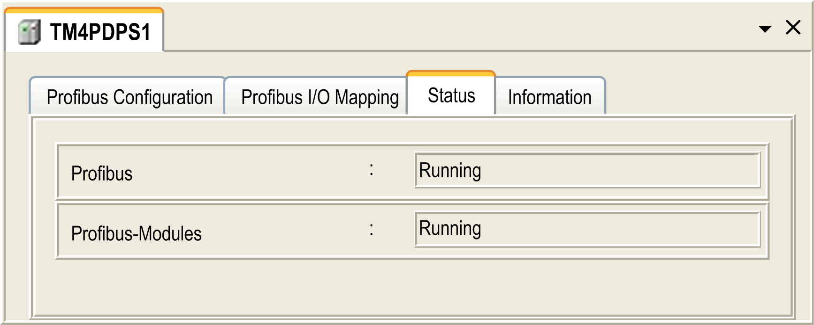

# Diagnostic Information

## Displaying General Diagnostics Data

To display general diagnostic data, open the Status tab of the TM4PDPS1 configuration window:

## Monitoring the Status of the TM4PDPS1 Module

You can monitor the status of the TM4PDPS1 module with the `PROFIBUS_R` system data type described in the [M241 Controller PLCSystem Library Guide](../../../../../api/crossBook?lang=en-US&virtualBookName=m241sys&topicID=D_SE_0031689) or [M251 Controller PLCSystem Library Guide](../../../../../api/crossBook?lang=en-US&virtualBookName=m251sys&topicID=D_SE_0035734) depending on your controller.

## Fallback Management

When there is a PROFIBUS communication interruption (`i_CommState`=0), the outputs of the TM4PDPS1 are maintained to the last state transmitted by the PROFIBUS master.

The Fail Safe Mode as defined by the PROFIBUS DP standard is not supported by the TM4PDPS1 module.

## Messages on Detected Errors

Use `i_CommError` of the `PROFIBUS_R` system data type to visualize the detected error displayed.

The following message is displayed when no error is detected:

| Name | Value | Meaning |
| --- | --- | --- |
| SUCCESS | 0 hex | No error detected. |

The following message is displayed when Runtime errors are detected:

| Name | Value | Meaning |
| --- | --- | --- |
| WATCHDOG\_TIMEOUT | C000000C hex | The watchdog time has been exceeded. |

The following messages are displayed when Initialization errors are detected:

| Name | Value | Meaning |
| --- | --- | --- |
| INIT\_FAULT | C0000100 hex | The initialization was not successful. |
| DATABASE\_ACCESS\_FAILED | C0000101 hex | Access to data memory was not successful. |

The following messages are displayed when Configuration errors are detected:

| Name | Value | Meaning |
| --- | --- | --- |
| NOT\_CONFIGURED | C0000119 hex | The TM4PDPS1 PCI module is not configured. |
| CONFIGURATION\_FAULT | C0000120 hex | A configuration error has been detected. |
| INCONSISTENT\_DATA\_SET | C0000121 hex | Inconsistent set data have been detected. |
| DATA\_SET\_MISMATCH | C0000122 hex | A mismatch of set data has been detected. |
| INSUFFICIENT\_LICENSE | C0000123 hex | A license error has been detected. |
| PARAMETER\_ERROR | C0000124 hex | A parameter error has been detected. |
| INVALID\_NETWORK\_ADDRESS | C0000125 hex | The network address is not correct. |
| SECURITY\_MEMORY | C0000126 hex | The security memory is not available. |

The following messages are displayed when Network errors are detected:

| Name | Value | Meaning |
| --- | --- | --- |
| COMM\_NETWORK\_FAULT | C0000140 hex | A network communication error has been detected. |
| COMM\_CONNECTION\_CLOSED | C0000141 hex | The communication connection has been closed. |
| COMM\_CONNECTION\_TIMEOUT | C0000142 hex | A communication connection timeout has been detected. |
| COMM\_DUPLICATE\_NODE | C0000144 hex | A duplicate node has been detected. |
| COMM\_CABLE\_DISCONNECT | C0000145 hex | A disconnected cable has been detected. |
| PROFIBUS\_CONNECTION\_TIMEOUT | C009002E hex | A PROFIBUS connection timeout has been detected. |

EIO0000003149.04