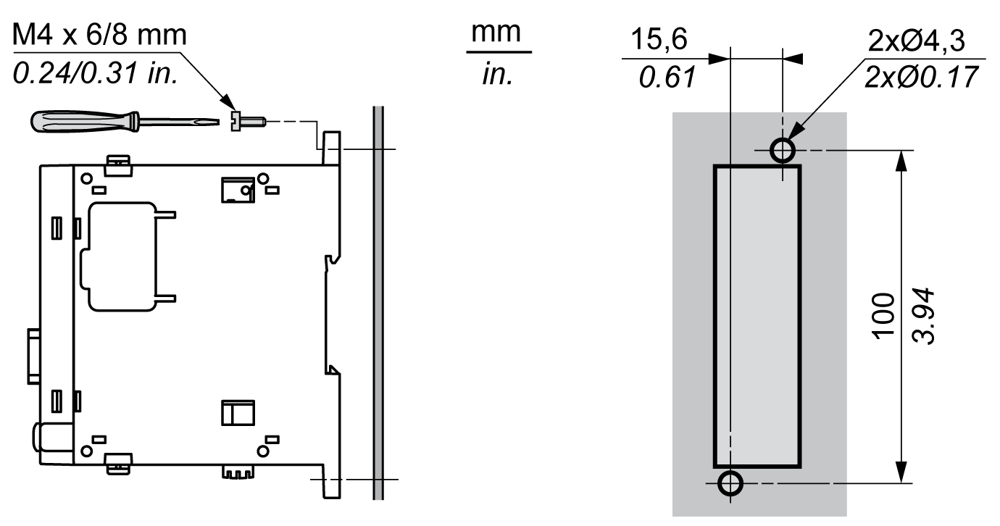

# Direct Mounting on a Panel Surface

## Overview

This section shows how to install the TM4 expansion module using the Panel Mounting Kit. This section also provides mounting hole layout for all modules.

## Mounting Hole Layout

The following diagram shows the mounting holes for the TM4 expansion modules:

EIO0000003155.01

© 2022

Schneider Electric.

All rights reserved.