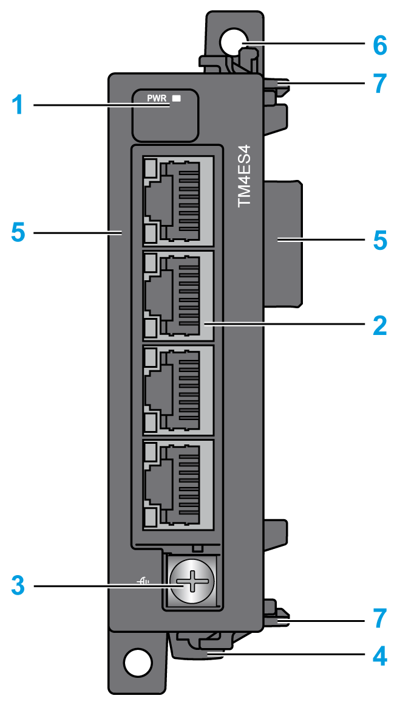
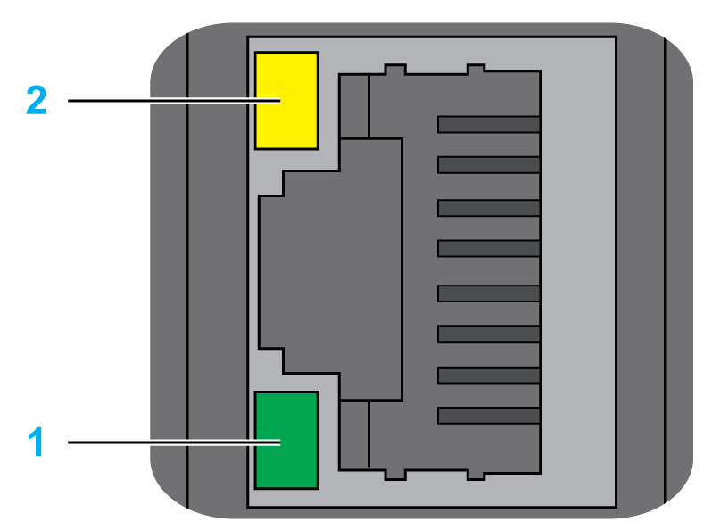

# TM4ES4 Presentation

## Overview

The TM4ES4 Ethernet module provides:

* An Ethernet interface to controller without an embedded Ethernet port.
* A second Ethernet port to controller with an embedded Ethernet port.

The module is also an Ethernet switch.

## Main Characteristics

This table describes the main characteristics of the TM4ES4 Ethernet communication module:

| Main Characteristics | Value |
| --- | --- |
| Standard | Ethernet |
| Connector type | 4 RJ45 connectors for Ethernet communication |
| Protocols | Ethernet Modbus TCP Client/Server, Ethernet/IP Adapter, UDP, TCP, SNMP, OPC UA server and EcoStruxure Machine Expert. |
| Grounding | 1 screw for functional ground connection |
| Transfer rate | 100 Mbit/s maximum |

This table presents the TM4ES4 Ethernet features provided to controllers:

| Controller | Additional Ethernet Interface | Ethernet Switch |
| --- | --- | --- |
| TM241C24• | Yes, one Ethernet port to connect to either the control network or the device network | Yes |
| TM241C40• |
| TM241CE24• | Yes, one Ethernet port to connect to the control network. The Ethernet port embedded on the logic controller connects to the device network. | Yes |
| TM241CEC24• |
| TM241CE40• |
| TM251MESE | No | Yes |
| TM251MESC |

## Architecture

The following figure shows an architecture example to connect a controller to an Ethernet network:

## Description

The following figure shows the main elements of the TM4ES4 module:

| Label | Elements | Refer to … |
| --- | --- | --- |
| 1 | LED that displays the power supply status | – |
| 2 | 4 Ethernet RJ45 connectors | – |
| 3 | Screw for functional ground connection | [Rules for the Connection to the Functional Ground](D-SE-0036333.html#D-SE-0036333__D-SE-0036333.8) |
| 4 | Clip-on lock for 35 mm (1.38 in.) top hat section rail (DIN-rail) | [Top Hat Section Rail (DIN rail)](D-SE-0009395.html#D-SE-0009395) |
| 5 | Connector for TM4 expansion modules (one on each side) | – |
| 6 | Locking device for attachment to the previous module | – |
| 7 | Clip for attachment to the previous module or the controller | – |

## Module Status LED

The figure shows the TM4ES4 status LEDs:

The table shows the description the TM4ES4 status LED:

| LED | Color | Status | Description |
| --- | --- | --- | --- |
| **PWR** | Green | On | Indicates that power is applied |
| Off | Indicates that power is removed |

## RJ45 Connector Status LEDs

The figure shows the RJ45 connector status LEDs:

The table describes the RJ45 connector status LED:

| Label | Description | LED | | |
| --- | --- | --- | --- | --- |
| Color | Status | Description |
| 1 | Ethernet activity | Green | Off | No activity |
| On | Transmitting or receiving data |
| 2 | Ethernet link | Green/Yellow | Off | No link |
| Solid yellow | Link at 10 Mbit/s |
| Solid green | Activity at 100 Mbit/s |

EIO0000003155.01

© 2022

Schneider Electric.

All rights reserved.