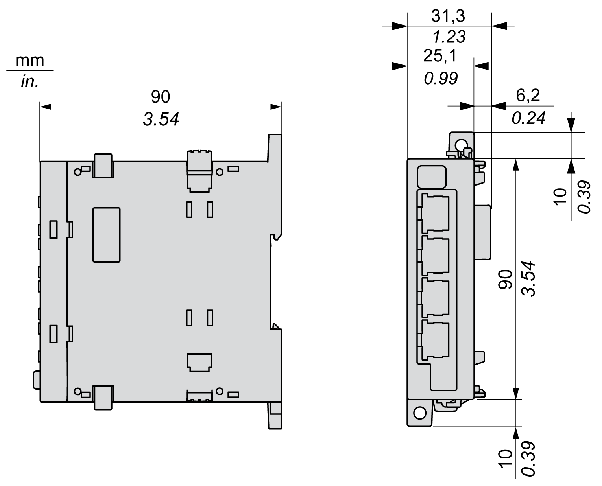

# TM4ES4 Characteristics

## Introduction

These are the general characteristics of the TM4ES4 module.

See also [Environmental Characteristics](D-SE-0038699.html#D-SE-0038699).

| WARNING | |
| --- | --- |
|  | UNINTENDED EQUIPMENT OPERATION  Do not exceed any of the rated values specified in the environmental and electrical characteristics tables.  Failure to follow these instructions can result in death, serious injury, or equipment damage. |

## Dimensions

The following diagrams show the dimensions of the TM4ES4 module:

## General Characteristics

The table describes the general characteristics of the TM4ES4 module:

| Characteristic | | Value |
| --- | --- | --- |
| Consumption | | 360 mA |
| Power dissipation | | 2.5 W |
| Weight | | 125 g (4.41 oz) |

## Characteristics

The table describes the characteristics of the TM4ES4 module:

| Characteristic | Description |
| --- | --- |
| Standard | Ethernet |
| Connector type | RJ45 |
| Baud rate | Supports Ethernet "10BaseT" and "100BaseTX" with auto-negotiation |
| Auto-crossover | MDI / MDIX |

NOTE: The controller supports the MDI/MDIX auto-crossover cable function. It is not necessary to use special Ethernet crossover cables to connect devices directly to this port (connections without an Ethernet hub or switch).

EIO0000003155.01

© 2022

Schneider Electric.

All rights reserved.