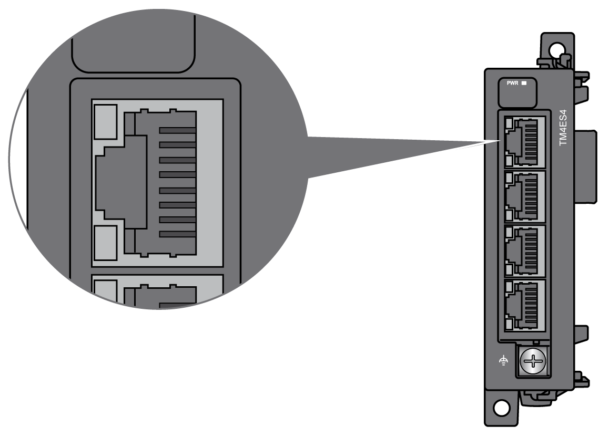
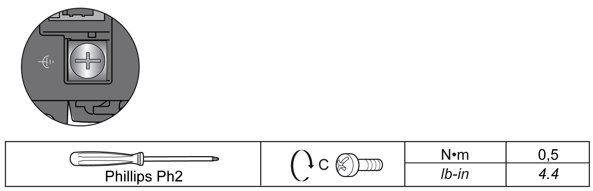

# TM4ES4 Wiring Diagram

## Wiring Rules

See [Wiring Best Practices](D-SE-0026685.html#D-SE-0026685).

## RJ45 Connector

The TM4ES4 module is equipped with 4 Ethernet RJ45 connectors:

## Pin Assignment

The figure shows the Ethernet RJ45 connector pins:

The table describes the Ethernet RJ45 connector pins assignment:

| Pin N° | Signal |
| --- | --- |
| 1 | TD+ |
| 2 | TD- |
| 3 | RD+ |
| 4 | – |
| 5 | – |
| 6 | RD- |
| 7 | – |
| 8 | – |

## Rules for Connection to the Functional Ground

The following table shows the characteristics of the screw to be used with the provided Functional Earth (FE) Cable:

Applying torque above the limit may damage the terminal screw or threads.

| NOTICE | |
| --- | --- |
|  | INOPERABLE EQUIPMENT  Do not tighten screw terminals beyond the specified maximum torque (Nm / lb-in.).  Failure to follow these instructions can result in equipment damage. |

EIO0000003155.01

© 2022

Schneider Electric.

All rights reserved.