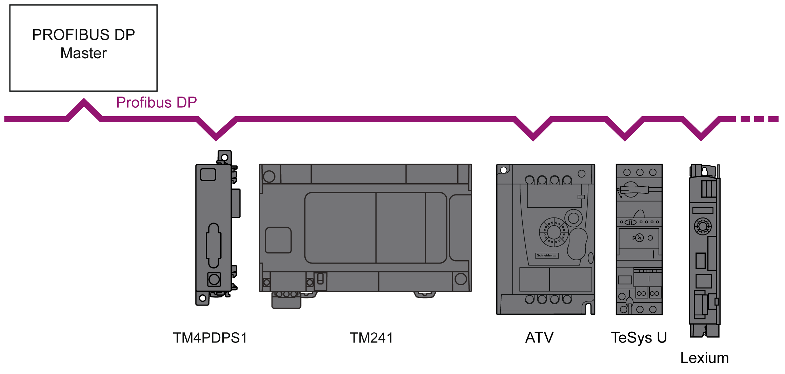
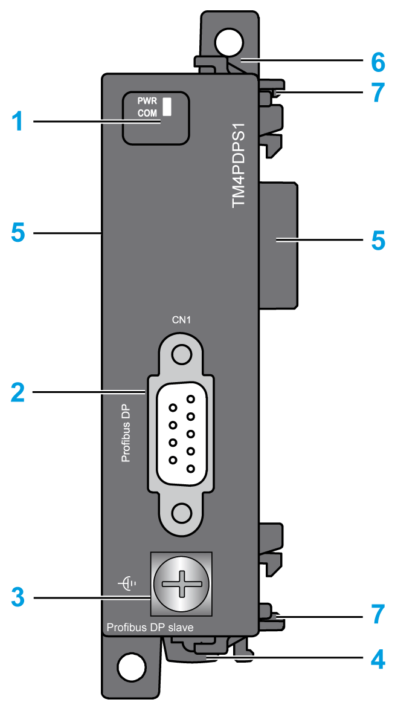

# TM4PDPS1 Presentation

## Overview

The TM4PDPS1 PROFIBUS DP slave module allows you to connect the controller to a PROFIBUS DP fieldbus.

## Main Characteristics

The table describes the main characteristics of the TM4PDPS1 PROFIBUS DP slave module:

| Main Characteristics | Value |
| --- | --- |
| Fieldbus | PROFIBUS DP slave |
| Interface type | RS-485 |
| Connector type | SUB-D 9, female |
| Grounding | 1 screw for functional ground connection |
| Transfer rate | 12 Mbit/s maximum |

## Architecture Example

The following figure shows an architecture example to connect an M241 controller to a PROFIBUS DP fieldbus:

## Description

The following figure shows the main elements of the TM4PDPS1 module:

| Label | Elements | Refer to … |
| --- | --- | --- |
| 1 | LEDs that display the module status | – |
| 2 | 1 SUB-D 9, female connector | – |
| 3 | Screw for functional ground connection | [Rules for Connection to the Functional Ground](D-SE-0036342.html#D-SE-0036342__D-SE-0036342.5) |
| 4 | Clip-on lock for 35 mm (1.38 in.) top hat section rail (DIN-rail) | [Top Hat Section Rail (DIN rail)](D-SE-0009395.html#D-SE-0009395) |
| 5 | Connector for TM4 expansion modules (one on each side) | – |
| 6 | Locking device for attachment to the previous module | – |
| 7 | Clip for attachment to the previous module or the controller | – |

## Status LEDs

The figure shows the TM4PDPS1 status LEDs:

The table describes the TM4PDPS1 status LEDs:

| LEDs | Color | Status | Description |
| --- | --- | --- | --- |
| **PWR** | Green / Yellow | Off | Indicates that power is removed |
| Green | On | Indicates that power is applied |
| Green / Yellow | Flashing Green / Yellow | Module start in progress |
| **COM** | Green | On | The module is in RUN mode, performing cyclic communication |
| Red | Cyclic flashing | The module is in STOP mode, no communication is performed, a connection error has been detected |
| Acyclic flashing | The module is not configured |

EIO0000003155.01

© 2022

Schneider Electric.

All rights reserved.