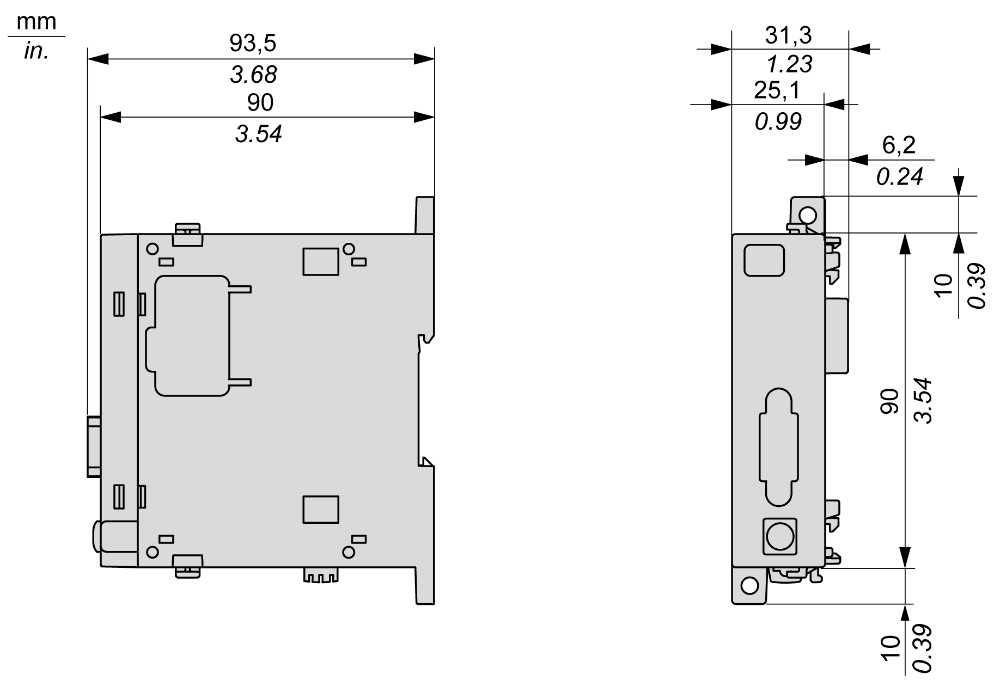

# TM4PDPS1 Characteristics

## Introduction

These are the general characteristics for the TM4PDPS1 module.

See also [Environmental Characteristics](D-SE-0038699.html#D-SE-0038699).

| WARNING | |
| --- | --- |
|  | UNINTENDED EQUIPMENT OPERATION  Do not exceed any of the rated values specified in the environmental and electrical characteristics tables.  Failure to follow these instructions can result in death, serious injury, or equipment damage. |

## Dimensions

The following diagrams show the dimensions of the TM4PDPS1 module:

## General Characteristics

The table describes the general characteristics of the TM4PDPS1 module:

| Characteristic | | Value |
| --- | --- | --- |
| Consumption | | 290 mA |
| Power dissipation | | 1.5 W |
| Weight | | 100 g (3.52 oz) |

## PROFIBUS DP Module Characteristics

The table describes the PROFIBUS DP characteristics of the TM4PDPS1 module:

| Characteristic | Value | |
| --- | --- | --- |
| Type of interface | Free of potential | |
| PROFIBUS standards | DP-V0, DP-V1 | |
| PROFIBUS baudrate | 3…12 Mbit/s | at 100 m cable length |
| 1.5 Mbit/s | at 200 m cable length |
| 500 kBit/s | at 400 m cable length |
| 187.5 kBit/s | at 1000 m cable length |
| 9.6…93.75 kBit/s | at 1200 m cable length |
| Physical | EIA-485 | |
| Isolation between PROFIBUS DP and internal electronics | 1.0 kV | |
| Cable requirements | Impedance | 135…165 Ohm at 20 MHz |
| Capacitance | < 30 pF per meter |
| Lead cross section | > 0.34 mm2, equates to AWG22 |
| Cable type | Paired 1 x 2 or 2 x 2 or 1 x 4 |
| Loop resistance | < 110 Ohm at 1 km |
| Signal loss | < 9 dB over the whole bus-segment |
| Shielding | Copper shielding |

NOTE: Do not connect more than 32 stations per segment without a repeater or more than 127 with a repeater.

EIO0000003155.01

© 2022

Schneider Electric.

All rights reserved.