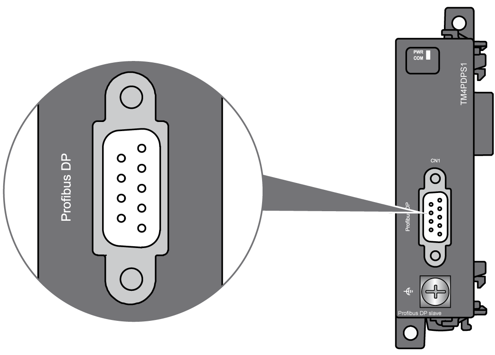
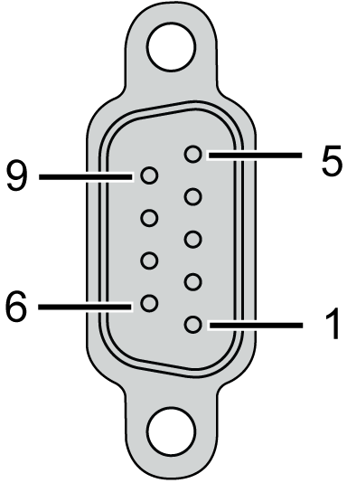
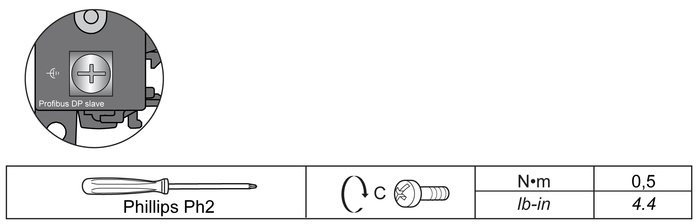

# TM4PDPS1 Wiring Diagram

## Wiring Rules

See [Wiring Best Practices](D-SE-0026685.html#D-SE-0026685).

## SUB-D 9 Connector

The TM4PDPS1 module is equipped with 1 PROFIBUS DP SUB-D 9 connector:

## Pin Assignment

The figure shows the PROFIBUS DP SUB-D 9 connector pins:

The table describes the PROFIBUS DP SUB-D 9 connector pins assignment:

| Pin N° | PROFIBUS DP | Description |
| --- | --- | --- |
| 1 | Reserved | – |
| 2 | Reserved | – |
| 3 | RxD/TxD-P | Transmit/receive data High |
| 4 | CNTR-P | Transmit enable High |
| 5 | DGND | Signal Ground |
| 6 | VP | Voltage 5 V (100 mA) |
| 7 | Reserved | – |
| 8 | RxD/TxD-N | Transmit/receive data Low |
| 9 | Reserved | – |

## Rules for Connection to the Functional Ground

The following table shows the characteristics of the screw to be used with the provided Functional Earth (FE) Cable:

Applying torque above the limit may damage the terminal screw or threads.

| NOTICE | |
| --- | --- |
|  | INOPERABLE EQUIPMENT  Do not tighten screw terminals beyond the specified maximum torque (Nm / lb-in.).  Failure to follow these instructions can result in equipment damage. |

EIO0000003155.01

© 2022

Schneider Electric.

All rights reserved.