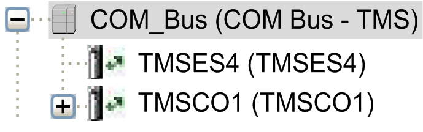
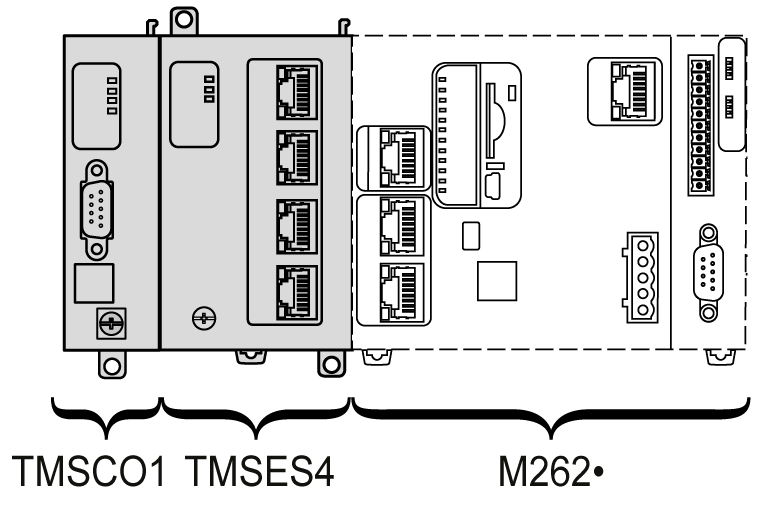

# Adding a TMS Expansion Module

## Adding a TMS Expansion Module

To add a TMS expansion module to your controller, select the expansion module in the Hardware Catalog, drag it to the Devices tree, and drop it on the COM\_Bus node.

For more information on adding a device to your project, refer to:

• Using the [Drag-and-drop Method](../../../../../api/crossBook?lang=en-US&virtualBookName=SoMProg&topicID=D_SE_0083368)

• Using the [Contextual Menu or Plus Button](../../../../../api/crossBook?lang=en-US&virtualBookName=SoMProg&topicID=D_SE_0083370)

## Expansion Module Layout

In the software, the module layout is displayed from the top to the bottom:

Physically, the expansion modules are connected from the right to the left:

For more information about the compatibility with the M262 Logic/Motion Controller, refer to [TMS Expansion Module Features](D-SE-0082684.html#D-SE-0082684__D-SE-0082684.6).

## Configuring an Expansion Module

To configure your TMS expansion module, double-click the expansion module node in the Devices tree.

EIO0000003691.06