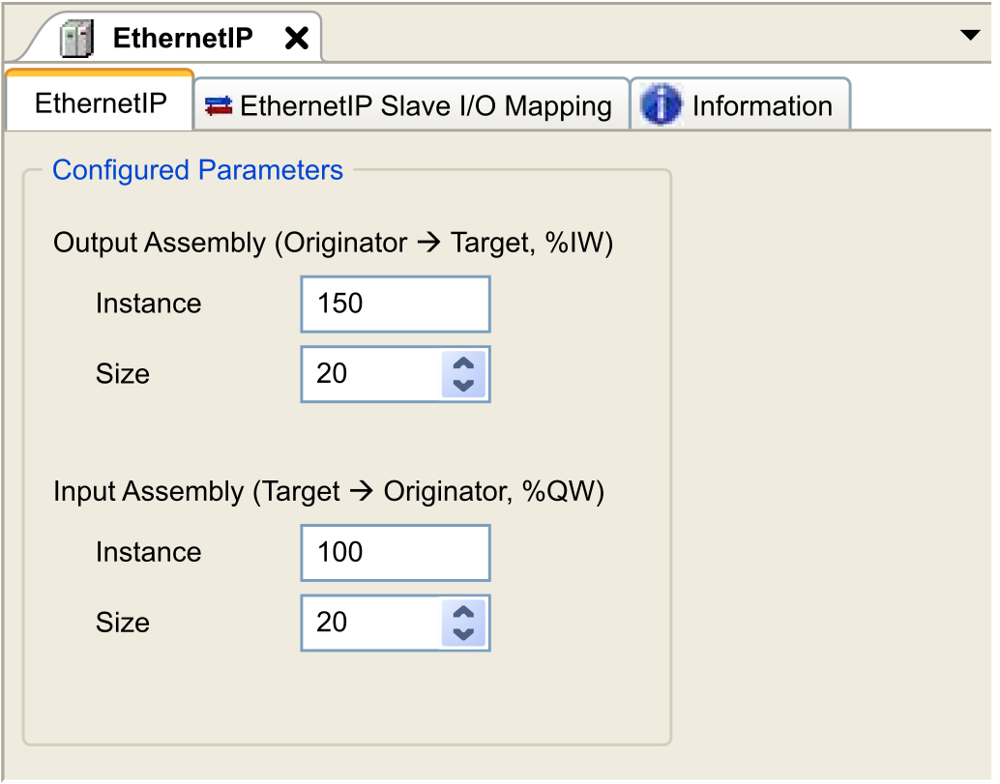

# Modicon M262 Logic/Motion Controller as a Target Device on EtherNet/IP

## Introduction

This section describes the configuration of the M262 Logic/Motion Controller as an EtherNet/IP target device.

For further information about EtherNet/IP, refer to the [www.odva.org](https://www.odva.org) website.

## EtherNet/IP Target Configuration

To configure your M262 Logic/Motion Controller as a target device on Ethernet/IP, follow these steps:

| Step | Action |
| --- | --- |
| 1 | Select EthernetIP in the Hardware Catalog. |
| 2 | Drag and drop it to the Devices tree on one of the highlighted nodes.  NOTE: If the chosen node is COM\_Bus, a TMSES4 expansion module is automatically added to your configuration.  For more information on adding a device to your project, refer to:  • Using the [Drag-and-drop Method](../../../../../api/crossBook?lang=en-US&virtualBookName=SoMProg&topicID=D_SE_0083368)  • Using the [Contextual Menu or Plus Button](../../../../../api/crossBook?lang=en-US&virtualBookName=SoMProg&topicID=D_SE_0083370) |

## EtherNet/IP Parameters Configuration

To configure the EtherNet/IP parameters, double-click EthernetIP in the Devices Tree.

This dialog box is displayed:

The EtherNet/IP I/O configuration parameters are defined as:

* Instance:

  Number referencing the input or output Assembly.
* Size:

  Number of channels of an input or output Assembly.

  Each channel has a 2-byte memory that stores the value of an %IW*x* or %QW*x* object, where *x* is the channel number.

  For example, if the Size of the Output Assembly is 20, there are 20 input channels (IW0...IW19) addressing %IWy...%IW(y+20-1), where y is the first available channel for the Assembly.

| Element | | Admissible Controller Range | Default Value |
| --- | --- | --- | --- |
| Output Assembly | Instance | 150...189 | 150 |
| Size | 2...250 | 20 |
| Input Assembly | Instance | 100...149 | 100 |
| Size | 2...250 | 20 |

Refer to the [Modicon M262 Logic/Motion Controller Programming Guide](../../../../../api/crossBook?lang=en-US&virtualBookName=m262prg&topicID=D_SE_0057366) for more information on the following topics:

* Generating an EDS file
* Configuring I/Os
* Objects supported by the controller

EIO0000003691.06