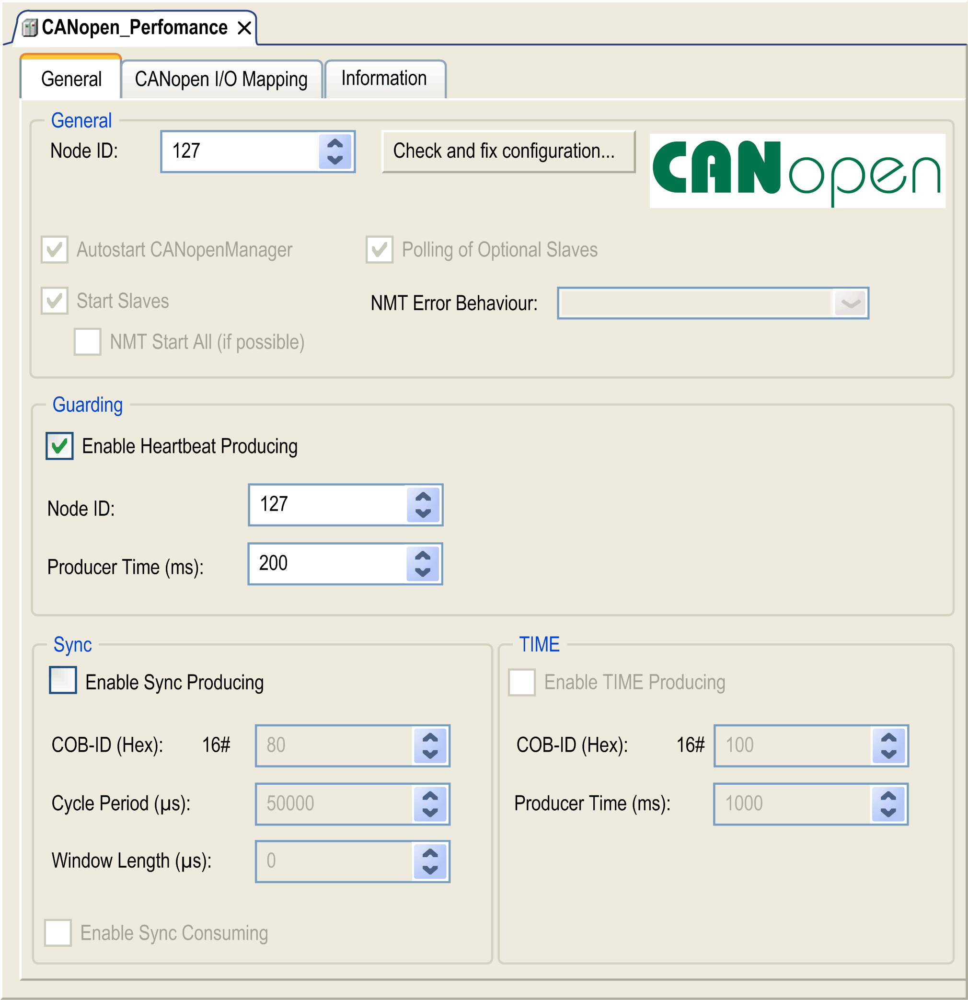

# Configuring the CANopen Interface

## Introduction

CANopen is an open industry-standard communication protocol and device profile specification (EN 50325-4) that is based on the Controller Area Network (CAN) protocol. The "Layer 7" CAN protocol was developed for embedded networking applications and defines communication and device functions for CAN-based systems.

CANopen supports both cyclic and event driven communication, allowing you to reduce bus load to a minimum but still maintain short reaction times.

You can set up your CANopen communications using a TMSCO1 module. This module connects to the communication bus (COM\_Bus) on the left side of the controller, using the left bus connector interface. You can connect one TMSCO1 module. It must be the last module on the left side of the controller.

## Configuring the CAN Bus

To configure the CAN bus of your controller, proceed in the following way:

| Step | Action |
| --- | --- |
| 1 | Add a TMSCO1 module. |
| 2 | In the Devices tree, double-click TMSCO1. |
| 3 | Configure the baudrate (by default: 250000 bits/s):    NOTE: The Online Bus Access option allows you to block SDO, DTM, and NMT sending through the status screen. |

When connecting a DTM to a device using the network, the DTM communicates in parallel with the running application. The overall performance of the system is impacted and may overload the network, and therefore have consequences for the coherency of data across devices under control.

| WARNING | |
| --- | --- |
|  | UNINTENDED EQUIPMENT OPERATION  Place your machine or process in a state such that DTM communications does not impact its performance.  Failure to follow these instructions can result in death, serious injury, or equipment damage. |

## Adding a CANopen Performance Manager

Adding a TMSCO1 module adds automatically the CANopen Performance Manager functionality to your controller.

## Configuring a CANopen Performance Manager

To configure CANopen Performance, double-click COM\_Bus > TMSCO1 > CANopen Performance in the Devices tree.

This dialog box appears:

The General tab of the CANopen\_Performance configuration dialog box is divided into four areas:

* General: General information containing node ID and enabled configuration options.
* Guarding: If Enable Heartbeat Producing is selected, guarding is enabled and the NMT master can verify the state of individual nodes. The heartbeat mechanism allows the network master to detect a loss of communication from the network slaves and the network slaves to react to a loss of communication from the master. The default setting is heartbeat producing at 200 ms.
* Sync: If Enable Sync Producing is selected, a specific event object is added. The **TMSCO1\_Sync** task is added to the Application > Task Configuration node in the Applications tree.

  If you deselect the Enable Sync Producing option in this dialog box, the **TMSCO1\_Sync** task is automatically deleted from the Applications Tree in your program.

  NOTE: Do not delete or change the Type or External event attributes of **TMSCO1\_Sync** tasks. If you do so, the software will detect an error when you attempt to build the application, and you will not be able to download it to the controller.
* TIME: Not editable.

## CANopen Operating Limits

The CANopen master has the following operating limits:

* Maximum number of slave devices: 63
* Maximum number of Receive PDO (RPDO): 252
* Maximum number of Transmit PDO (TPDO): 252

| WARNING | |
| --- | --- |
|  | UNINTENDED EQUIPMENT OPERATION  * Do not connect more than 63 CANopen slave devices to the controller * Program your application to use 252 or fewer Transmit PDO (TPDO). * Program your application to use 252 or fewer Receive PDO (RPDO).  Failure to follow these instructions can result in death, serious injury, or equipment damage. |

## CAN Bus Format

The CAN bus format is CAN2.0A for CANopen.

EIO0000003691.06