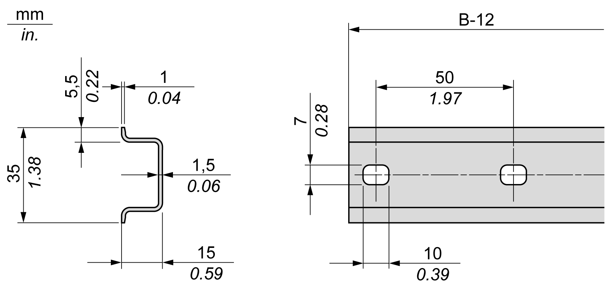
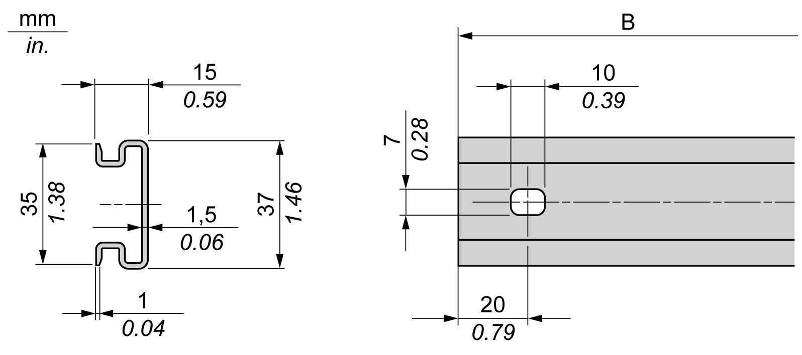
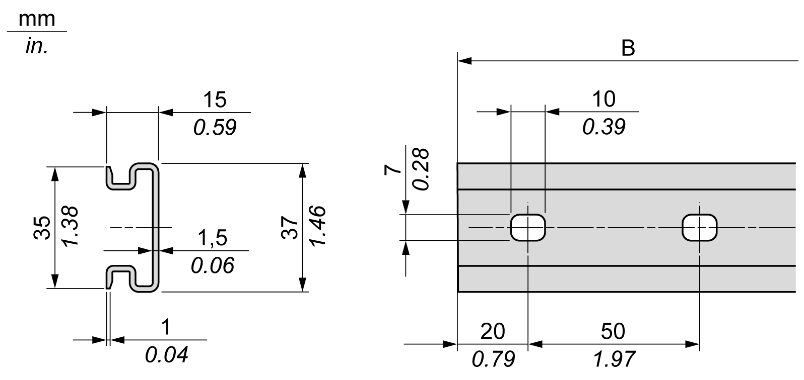

# Top Hat Section Rail (DIN rail)

## Dimensions of Top Hat Section Rail DIN Rail

You can mount the controller or receiver and their expansions on a 35 mm (1.38 in.) top hat section rail (DIN rail). The DIN rail can be attached to a smooth mounting surface or suspended from an EIA rack or mounted in a NEMA cabinet.

## Symmetric Top Hat Section Rails (DIN Rail)

The following illustration and table indicate the references of the top hat section rails (DIN rail) for the wall-mounting range:

| **Reference** | Type | **Rail Length (B)** |
| --- | --- | --- |
| NSYSDR50A | A | 450 mm (17.71 in.) |
| NSYSDR60A | A | 550 mm (21.65 in.) |
| NSYSDR80A | A | 750 mm (29.52 in.) |
| NSYSDR100A | A | 950 mm (37.40 in.) |

The following illustration and table indicate the references of the symmetric top hat section rails (DIN rail) for the metal enclosure range:

| **Reference** | Type | **Rail Length (B-12 mm)** |
| --- | --- | --- |
| NSYSDR60 | A | 588 mm (23.15 in.) |
| NSYSDR80 | A | 788 mm (31.02 in.) |
| NSYSDR100 | A | 988 mm (38.89 in.) |
| NSYSDR120 | A | 1188 mm (46.77 in.) |

The following illustration and table indicate the references of the symmetric top hat section rails (DIN rail) of 2000 mm (78.74 in.):

| **Reference** | Type | **Rail Length** |
| --- | --- | --- |
| NSYSDR2001 | A | 2000 mm (78.74 in.) |
| NSYSDR200D2 | A |
| **1** Unperforated galvanized steel  **2** Perforated galvanized steel | | |

## Double-Profile Top Hat Section Rails (DIN rail)

The following illustration and table indicate the references of the double-profile top hat section rails (DIN rails) for the wall-mounting range:

| **Reference** | Type | **Rail Length (B)** |
| --- | --- | --- |
| NSYDPR25 | W | 250 mm (9.84 in.) |
| NSYDPR35 | W | 350 mm (13.77 in.) |
| NSYDPR45 | W | 450 mm (17.71 in.) |
| NSYDPR55 | W | 550 mm (21.65 in.) |
| NSYDPR65 | W | 650 mm (25.60 in.) |
| NSYDPR75 | W | 750 mm (29.52 in.) |

The following illustration and table indicate the references of the double-profile top hat section rails (DIN rail) for the floor-standing range:

| **Reference** | Type | **Rail Length (B)** |
| --- | --- | --- |
| NSYDPR60 | F | 588 mm (23.15 in.) |
| NSYDPR80 | F | 788 mm (31.02 in.) |
| NSYDPR100 | F | 988 mm (38.89 in.) |
| NSYDPR120 | F | 1188 mm (46.77 in.) |

EIO0000003699.04

© 2022

Schneider Electric.

All rights reserved.