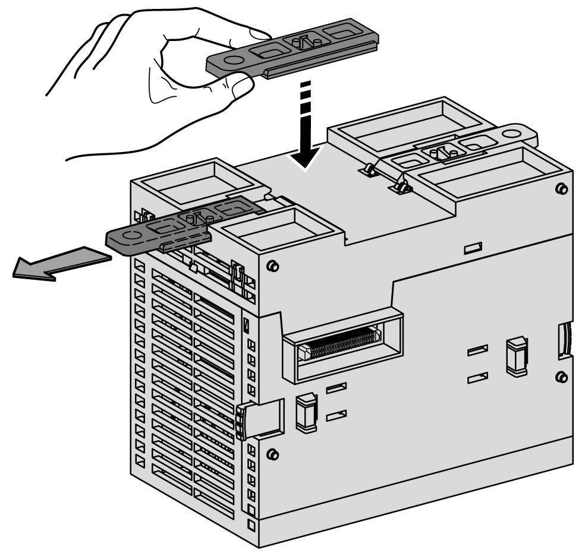
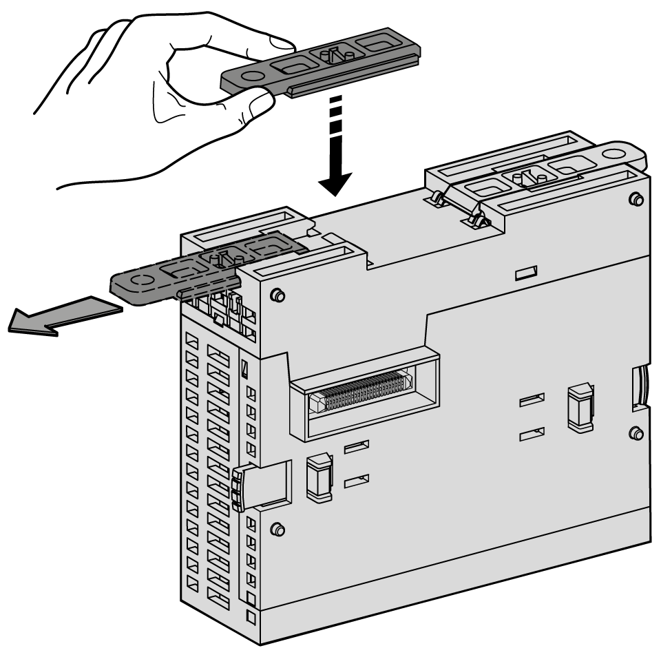
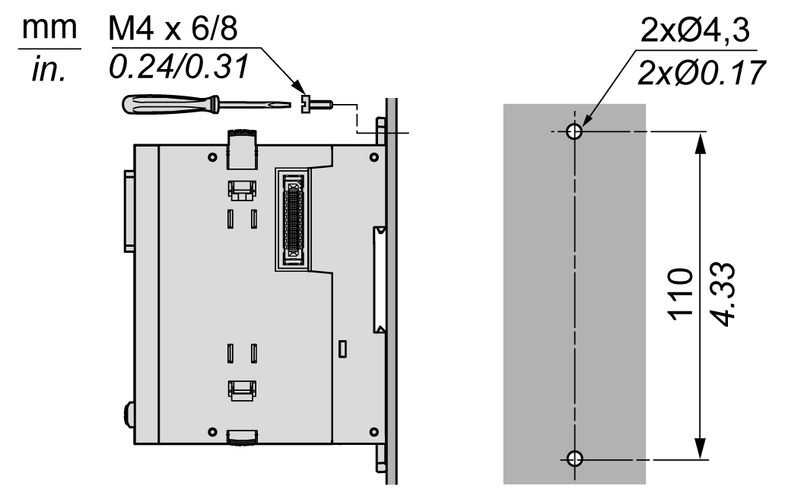
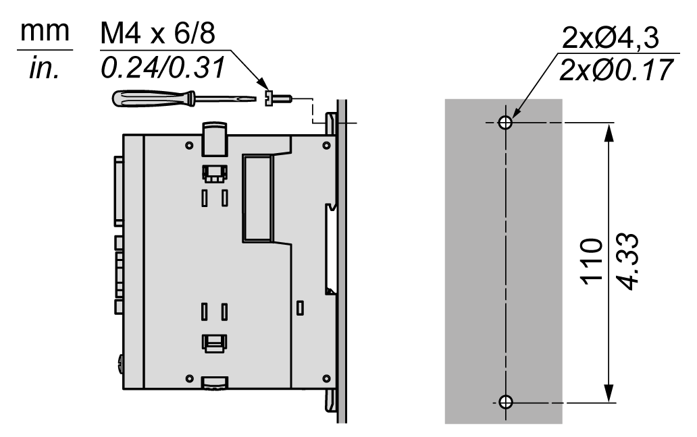

# Direct Mounting on a Panel Surface

## Overview

This section shows how to install the TMS expansion modules using the panel attachment kit (included). This section also provides mounting hole layout for all modules.

## Panel Attachment Kit

The following diagrams show the mounting of the panel attachment kit:

**TMSES4**

**TMSCO1**

## Mounting Hole Layout

The following diagrams show the mounting holes for the TMS expansion modules:

**TMSES4**

**TMSCO1**

EIO0000003699.04

© 2022

Schneider Electric.

All rights reserved.