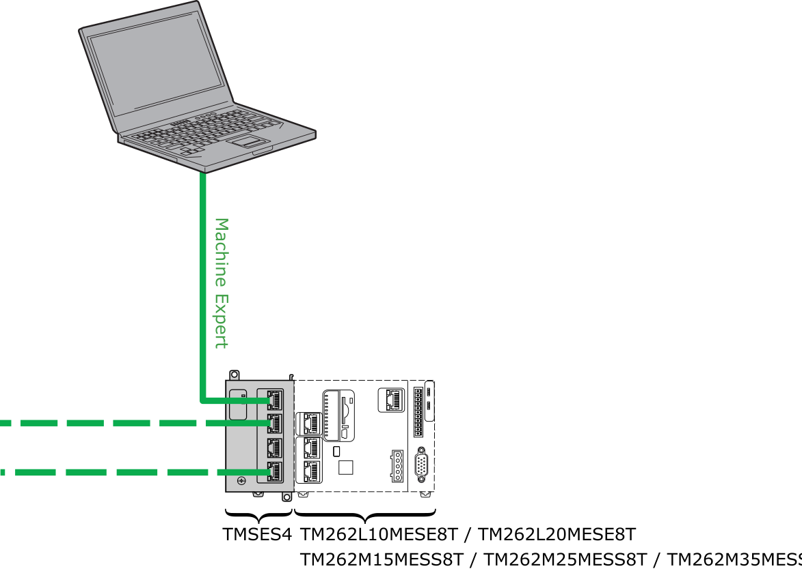
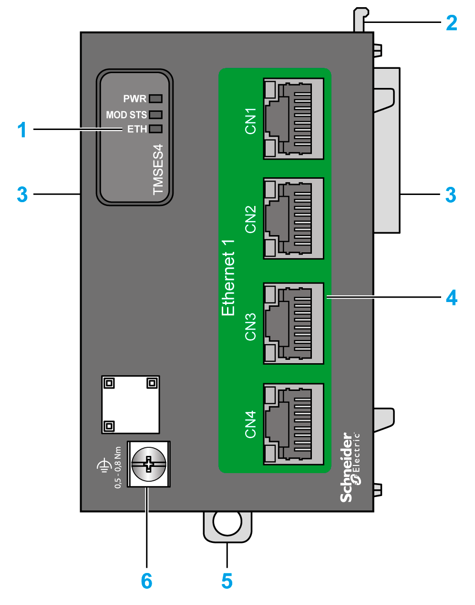
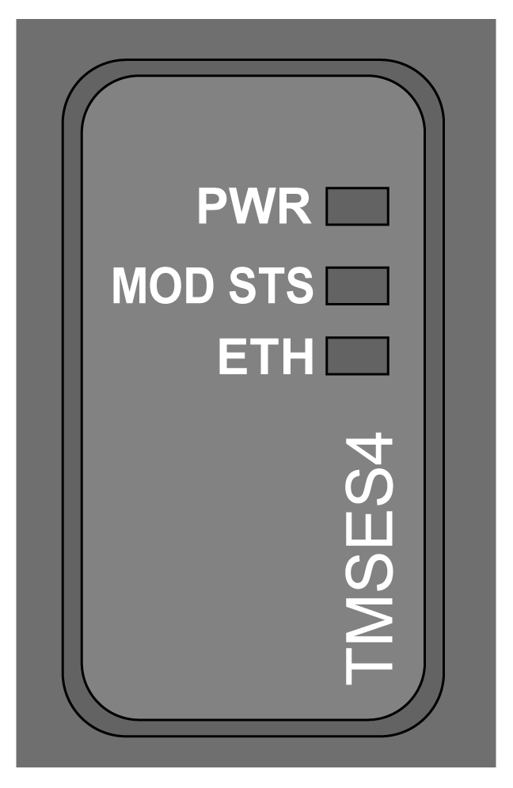

# TMSES4 Presentation

## Overview

The TMSES4 Ethernet module provides an additional Ethernet interface to the controller. A maximum of three TMSES4 modules can be configured in the system.

The TMSES4 Ethernet module is compatible with the following controllers references:

* TM262L10MESE8T
* TM262L20MESE8T
* TM262M15MESS8T
* TM262M25MESS8T
* TM262M35MESS8T

The MAC address of the TMSES4 is unique for the three TMSES4, this MAC address is available on the label on the left side of the M262 Logic/Motion Controller.

## Main Characteristics

The table describes the main characteristics of the TMSES4 Ethernet communication module:

| Main Characteristics | |
| --- | --- |
| Standard | Ethernet |
| Connector type | 4 RJ45 connectors for Ethernet communication |
| Transfer rate | 1 Gbit/s maximum |

## Connection

The following illustration shows the connection of a controller to an Ethernet network:

NOTE: If you configure several TMSES4 modules, each module must be on a different subnetwork.

NOTE: TMSES4 modules must be on a different subnetwork than the controller Ethernet ports.

NOTE: Do not connect two TMSES4 modules together if they are mounted on the same controller.

NOTE: Do not connect a TMSES4 module to an Ethernet port on the controller on which it is mounted.

## Elements

The following illustration shows the main elements of the TMSES4 module:

| Label | Description |
| --- | --- |
| 1 | Status LEDs |
| 2 | Locking device |
| 3 | TMS bus connector |
| 4 | 4 Ethernet ports |
| 5 | Clip-on lock for 35 mm (*1.38 in.*) top hat section rail (DIN rail) |
| 6 | Functional ground screw |

## Module Status LED

The illustration shows the TMSES4 status LEDs:

The table describes the TMSES4status LED:

| LED | Color | Status | Description |
| --- | --- | --- | --- |
| **PWR** | Green | On | Power is applied. |
| Off | Power is removed. |
| **MOD STS** | Green | On | The module is running. |
| Red | On | The module is not running. |
| Flashing | A connection error or network saturation is detected. |
| **ETH** | Green | On | The module is running and one port is connected. |
| Flashing | * 3 flashes: no ports are connected. * 4 flashes: IP address is duplicated. * 5 flashes: IP address is awaiting. * 6 flashes: default IP address is applied. |
| Off | The module is initializing. |

## RJ45 Connector Status LEDs

The illustration shows the RJ45 connector status LEDs:

The table describes the RJ45 connector status LED:

| Label | Description | LED | | |
| --- | --- | --- | --- | --- |
| Color | Status | Description |
| 1 | Ethernet activity | Green | Off | No activity |
| On | Transmitting or receiving data |
| 2 | Ethernet link | Green/Yellow | Off | No link |
| Yellow | Link at 10 or 100 Mbit/s |
| Green | Link at 1 Gbit/s |

EIO0000003699.04

© 2022

Schneider Electric.

All rights reserved.