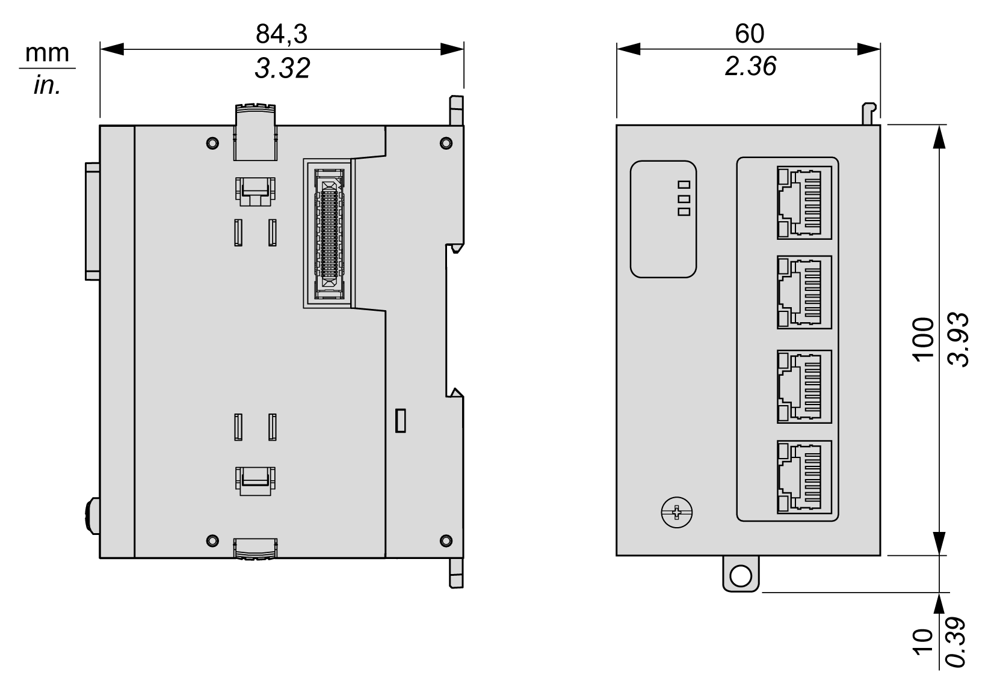

# TMSES4 Characteristics

## Introduction

These are the general characteristics of the TMSES4 module.

See also [Environmental Characteristics](D-SE-0070973.html#D-SE-0070973).

| WARNING | |
| --- | --- |
|  | UNINTENDED EQUIPMENT OPERATION  Do not exceed any of the rated values specified in the environmental and electrical characteristics tables.  Failure to follow these instructions can result in death, serious injury, or equipment damage. |

## Dimensions

The following diagrams show the dimensions of the TMSES4 module:

## General Characteristics

The table describes the general characteristics of the TMSES4 module:

| Characteristic | | Value |
| --- | --- | --- |
| Consumption | | 200 mA |
| Power dissipation | | 7.85 W |
| Weight | | 403 g (14.22 oz) |

## Characteristics

The table describes the characteristics of the TMSES4 module:

| Characteristics | Description |
| --- | --- |
| Standards | Ethernet |
| Connector type | RJ45 |
| Baud rate | Supports Ethernet "10BaseT", "100BaseTX" and "1000BaseT" with auto-negotiation |
| Auto-crossover | MDIO (1) |
| Bus connectors | 1 right connector to controller, male  1 left connector to next expansion, female |
| Installation | Left of the controller or after another TMSES4 expansion module. |
| **(1)** The controller supports MDIO auto-crossover cable function. It is not necessary to use special Ethernet crossover cables to connect devices directly to this port (connection without an Ethernet hub or switch.) | |

EIO0000003699.04

© 2022

Schneider Electric.

All rights reserved.