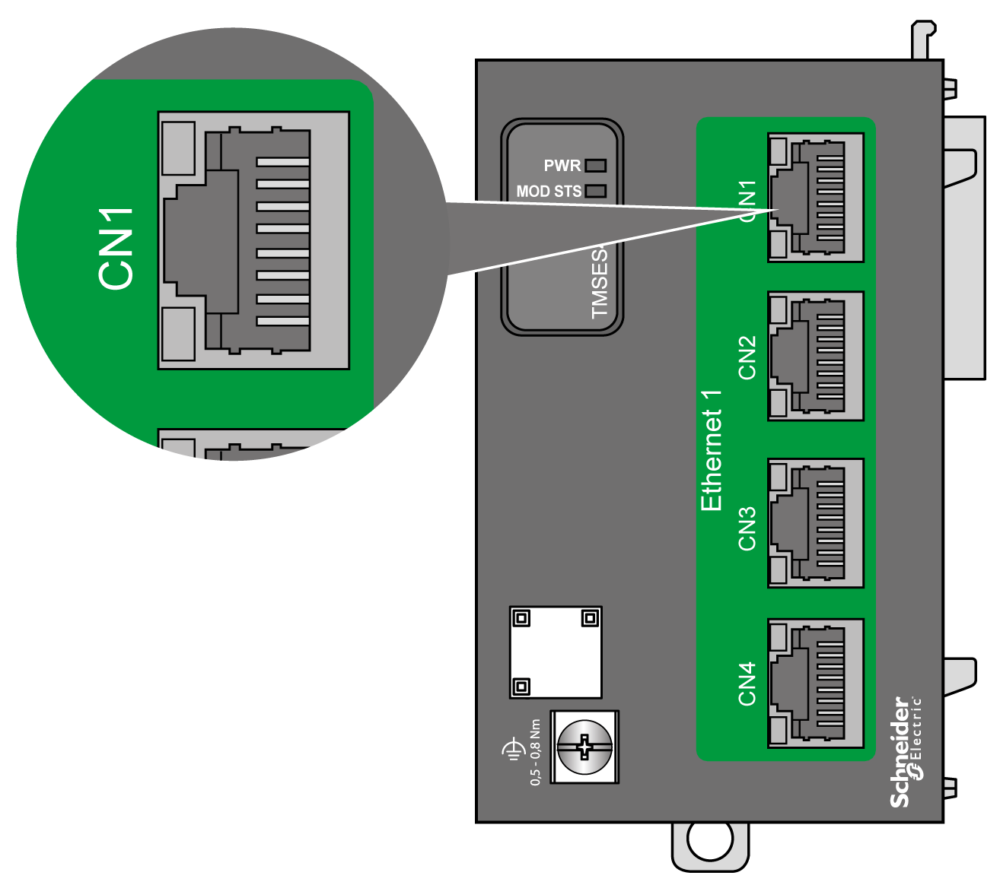

# TMSES4 Wiring Diagram

## Wiring Rules

See [Wiring Best Practices](D-SE-0026685.html#D-SE-0026685).

## RJ45 Connector

The TMSES4 module is equipped with four Ethernet RJ45 connectors:

## Pin Assignment

The following illustration shows the Ethernet RJ45 connector pin assignment:

The following table describes the Ethernet connector pin assignment:

| Pin N° | 100BASE-T | 1000BASE-T |
| --- | --- | --- |
| 1 | TD+ | DA+ |
| 2 | TD- | DA- |
| 3 | RD+ | DB+ |
| 4 | N.C. | DC+ |
| 5 | N.C. | DC- |
| 6 | RD- | DB- |
| 7 | N.C. | DD+ |
| 8 | N.C. | DD- |

NOTE: The controller supports the MDIO auto-crossover cable function. It is not necessary to use special Ethernet crossover cables to connect devices directly to this port (connections without an Ethernet hub or switch).

NOTE: Ethernet cable disconnection is detected every second. In case of disconnection of a short duration (< 1 second), the network status may not indicate the disconnection.

EIO0000003699.04

© 2022

Schneider Electric.

All rights reserved.