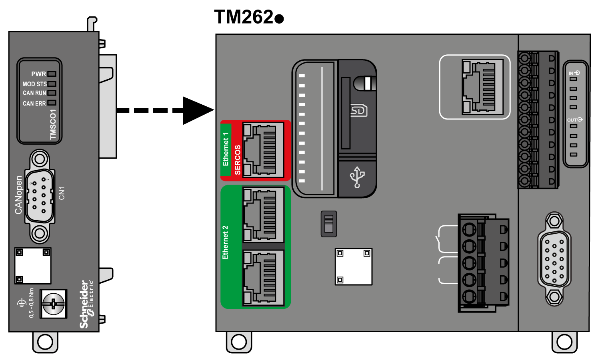
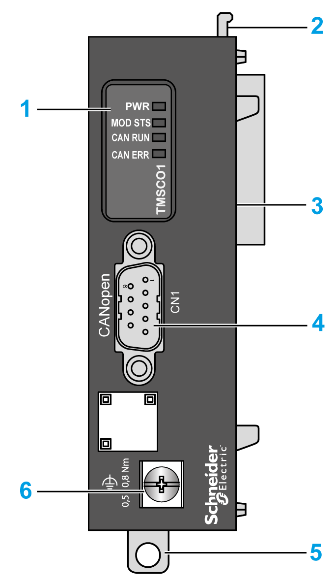
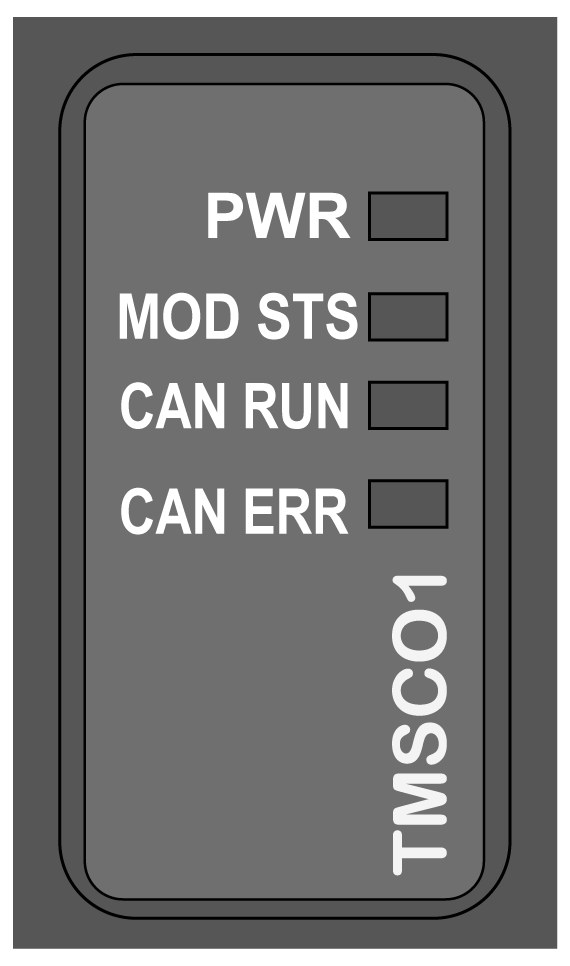

# TMSCO1 Presentation

## Overview

The TMSCO1 provides an additional communication module to the controller. Only one TMSCO1 can be configured in the system.

The TMSCO1 must be the leftmost module connected to the controller.

## Main Characteristics

The table describes the main characteristics of the TMSCO1 communication module:

| Main Characteristics | Value |
| --- | --- |
| Interface type | CANopen |
| Connector type | 1 SUB-D 9 pin male connector |

## Connection

The following illustration shows the connection of a TMSCO1 module to a controller:

## Description

The following illustration shows the elements of the TMSCO1 module:

The table shows the elements of the TMSCO1 interface module:

| Label | Elements |
| --- | --- |
| 1 | Status LEDs |
| 2 | Locking device |
| 3 | TMS bus connector |
| 4 | CANopen port |
| 5 | Clip-on lock for 35 mm (1.38 in.) top hat section rail (DIN-rail) |
| 6 | Functional ground screw |

## Module Status LED

The following illustration shows the TMSCO1 interface module status LEDs:

The table describes the TMSCO1 status LEDs:

| LED | Color | Status | Description |
| --- | --- | --- | --- |
| **PWR** | Green | On | Power is applied. |
| Off | Power is removed. |
| **MOD STS** | Green | On | The module is running. |
| Red | On | The module is not running. |
| Flashing | A connection error is detected. |
| **CAN RUN** | Green | On | The CANopen bus is operational. |
| Flashing | The CANopen bus is being initialized. |
| 1 flash per second | The CANopen bus is stopped. |
| Off | The CANopen master is configured. |
| **CAN ERR** | Red | On | The CANopen bus is stopped (BUS OFF). |
| Flashing | The CANopen configuration is invalid. |
| 1 flash per second | The module has detected that the maximum number of error frames has been reached or exceeded. |
| 2 flashes per second | The module has detected either a Node Guarding or Heartbeat event. |
| Off | The CANopen master is configured. |

EIO0000003699.04

© 2022

Schneider Electric.

All rights reserved.