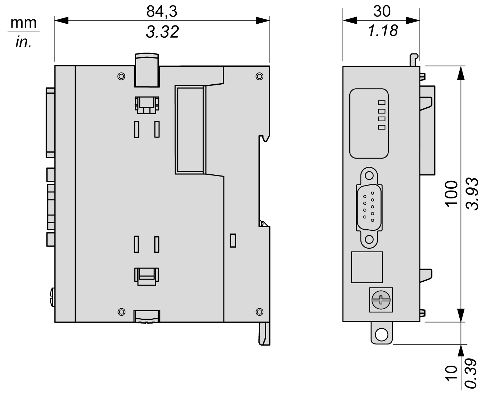

# TMSCO1 Characteristics

## Introduction

These are the general characteristics of the TMSCO1 module.

See also [Environmental Characteristics](D-SE-0070973.html#D-SE-0070973).

| WARNING | |
| --- | --- |
|  | UNINTENDED EQUIPMENT OPERATION  Do not exceed any of the rated values specified in the environmental and electrical characteristics tables.  Failure to follow these instructions can result in death, serious injury, or equipment damage. |

## Dimensions

The following diagram shows the dimensions of the TMSCO1 module:

## General Characteristics

The table describes the general characteristics of the TMSCO1 module:

| Characteristic | Value |
| --- | --- |
| Consumption | 50 mA |
| Power dissipation | 1.2 W |
| Weight | 150 g (5.29 oz) |

## CAN Characteristics

The following table provides the CAN characteristics of the TMSCO1 module:

| Characteristics | Value | | | | | | | |
| --- | --- | --- | --- | --- | --- | --- | --- | --- |
| Standards | CAN-CIA (ISO 11898-2:2002 Part 2) | | | | | | | |
| Connector type | SUB-D 9, male | | | | | | | |
| Protocol supported | CANopen | | | | | | | |
| CAN power distribution | No | | | | | | | |
| Isolation between CAN bus and ground | 550 Vac RMS, 780 Vdc | | | | | | | |
| Bus connectors | 1 right connector to controller, male  No connector on the left. | | | | | | | |
| Installation | Leftmost module connected to the controller. | | | | | | | |

EIO0000003699.04

© 2022

Schneider Electric.

All rights reserved.