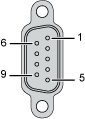

# TMSCO1 Wiring Diagram

## Wiring Rules

See [Wiring Best Practices](D-SE-0026685.html#D-SE-0026685).

## SUB-D9 Connector

The following figure shows the pins on the CANopen bus connector:

NOTE: Use an external CANopen line termination in your system wiring.

## Pin Assignment

The table describes the pins of the CANopen bus connector:

| Pin | Designation | Description |
| --- | --- | --- |
| 1 | N.C. | Reserved |
| 2 | CAN\_L | CAN\_L bus line (Low) |
| 3 | CAN\_GND | CAN 0 Vdc |
| 4 | N.C. | Reserved |
| 5 | CAN\_SHLD | Optional CAN shield |
| 6 | CAN\_GND | CAN 0 Vdc |
| 7 | CAN\_H | CAN\_H bus line (High) |
| 8 | N.C. | Reserved |
| 9 | N.C. | Reserved |
| N.C.: Not Connected. | | |

Although the cable shield is connected to pin 6 (ground), it is still necessary to properly and externally ground the cable shield [to your functional ground (FE)](D-SE-0083344.html#D-SE-0083344).

| WARNING | |
| --- | --- |
|  | UNINTENDED EQUIPMENT OPERATION  Do not connect wires to unused terminals and/or terminals indicated as “No Connection (N.C.)”.  Failure to follow these instructions can result in death, serious injury, or equipment damage. |

## Transmission Speed and Cable Length

Transmission speed is limited by the bus length and the type of cable used.

The following table describes the relationship between the maximum transmission speed and the bus length (on a single CAN segment without a repeater):

| Maximum transmission baud rate | Bus length |
| --- | --- |
| 1000 Kbps | 20 m (65 ft) |
| 800 Kbps | 40 m (131 ft) |
| 500 Kbps | 100 m (328 ft) |
| 250 Kbps | 250 m (820 ft) |
| 125 Kbps | 500 m (1,640 ft) |
| 50 Kbps | 1000 m (3280 ft) |
| 20 Kbps | 2500 m (16,400 ft) |

EIO0000003699.04

© 2022

Schneider Electric.

All rights reserved.