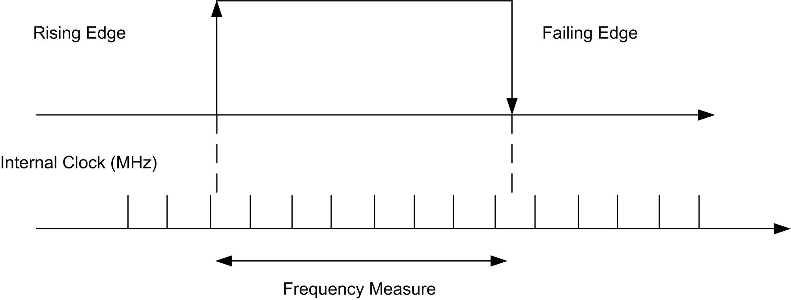
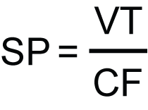

# TM5SDI2DF

## Introduction

The TM5SDI2DF expansion electronic module is a 24 Vdc input electronic module with 2 fast inputs.

For further information, refer to [TM5SDI2DF Electronic Module 2DI 24 Vdc Sink 3-Wire](../../../../../api/crossBook?lang=en-US&virtualBookName=tm5diohw&topicID=D_SE_0000763).

## TM5 Module I/O Mapping Tab

Variables can be defined and named in the TM5 Module I/O Mapping tab. Additional information such as topological addressing is also provided in this tab.

Refer to the following paragraphs:

* [Status Mapping](#D-SE-0032923__D-SE-0032923.13), for the status bits configuration details.
* [Input Mapping](#D-SE-0032923__D-SE-0032923.11), for the input parameters configuration details.

For further generic descriptions, refer to [User-Defined Parameters Tab Description](D-SE-0005771.html#D-SE-0005771__D-SE-0005771.5).

## Status Bit Mapping

This table describes the TM5SDI2DF status bit mapping configuration:

| Channel | Type | Description |
| --- | --- | --- |
| ModuleOK | BYTE | State of the compact I/O and electronic modules |
| DcOk | BOOL | Voltage range:   * 0: Invalid * 1: Valid |
| reserved | BOOL | Reserved |
| NetworkOk | BOOL | TM5 bus:   * 0: Bus error * 1: OK |
| I/O Data valid | BOOL | Data validity:   * 0: Valid * 1: Invalid |
| reserved | BOOL | Reserved |
| reserved | BOOL | Reserved |
| reserved | BOOL | Reserved |
| reserved | BOOL | Reserved |

## Input Mapping

This table describes the TM5SDI2DF input mapping configuration:

| Channel | | Type | Description |
| --- | --- | --- | --- |
| DigitalInputs | DigitalInput 0-1 | BYTE | State of all inputs |
| DigitalInputs00 | BOOL | State of input 0 |
| DigitalInputs01 | BOOL | State of input 1 |
| Counter00 | | UINT | Event counter or gate measurement |
| Counter01 | | UINT | Event counter or gate measurement |

For further generic descriptions, refer to [I/O Mapping Tab Description](D-SE-0005771.html#D-SE-0005771__D-SE-0005771.5).

## User-Defined Parameters Tab

This table describes the TM5SDI2DF user-defined parameters configuration:

| Name | Value | Default Value | Description |
| --- | --- | --- | --- |
| InputFilter | 0...127 | 10 | Specifies the filter time of all digital inputs, adjustable in steps of 100 µs. |

## Counter Mode

2 counter modes can be used with the TM5SDI2DF electronic module:

* Event counter operation - consists of transferring the counter status, registered with a fixed offset with respect to the bus cycle, and is transferred in the same cycle.

  NOTE: The rising edges are registered on the counter input.
* Gate measurement - consists of using an internal frequency to register the necessary time to reach the gate input.

  The following figure describes the gate measuring principle:

  

  The TM5SDI2DF value is defined by the following equation:

  

  Where:

  SP = Size of Pulse to be measured.

  VT = Value of TM5SDI2DF.

  CF = Clock Frequency.

  For example: For a Clock Frequency at 3 Mhz and a Size of Pulse to be measured = 15 ms, the value of TM5SDI2DF is near 45000.

NOTE:

* Only one of the counter channels can be used for gate measurement at any one time.
* The time between rising and falling edges for the gate input is registered using an internal frequency. The result is verified for overflow (FFFF hex).
* The recovery time between measurements must be > 100 µs.
* The measurement result is transferred with the falling edge to the result memory.

The following table gives the maximum Size of Pulse to be measured depending on the Count Frequency parameter:

| Maximum Size of Pulse | Clock Frequency |
| --- | --- |
| 1.3653125 ms | 48 MHz |
| 2.730625 ms | 24 MHz |
| 5.46125 ms | 12 MHz |
| 10.9225 ms | 6 MHz |
| 21.845 ms | 3 MHz |
| 43.69 ms | 1.5 MHz |
| 87.38 ms | 0.75 MHz |
| 174.76 ms | 0.375 MHz |
| 354.2432432 ms | 0.185 MHz |

For example: For a Clock Frequency at 48 Mhz, the maximum Size of Pulse to be measured = 1.3 ms.

Where VTmax = 65534 :  
SPmax = VTmax / CF  
SPmax = 65534 / 48\*10E6  
SPmax = 0.001365  
SPmax = 1.3 ms

## Additional Function Input Latch

Using this function, the positive edges of the input signal can be latched with a resolution of 200 µs. With the “Acknowledge - input latch” function, the input latch is either reset or prevented from latching.

It works in the same way as a dominant reset RS flip-flop:

| R: Status03 | S: Status02 | Q | Status |
| --- | --- | --- | --- |
| 0 | 0 | x | Do not change |
| 0 | 1 | 1 | Set |
| 1 | 0 | 0 | Reset |
| 1 | 1 | 0 | Reset |

EIO0000003179.01