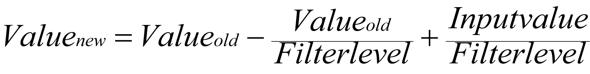
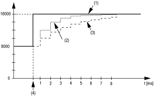
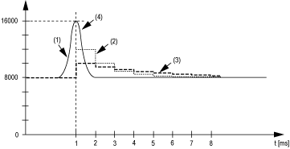
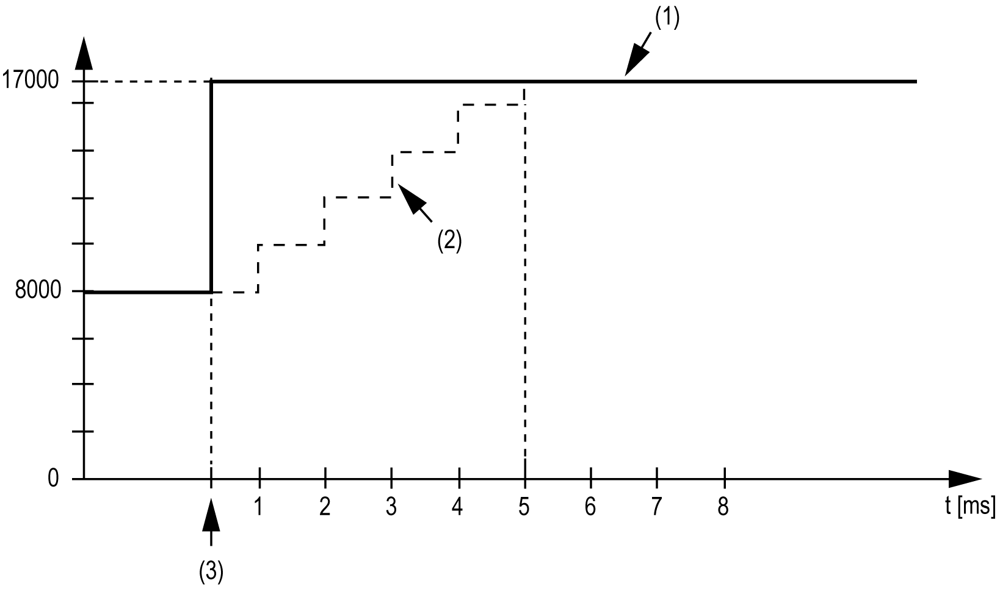
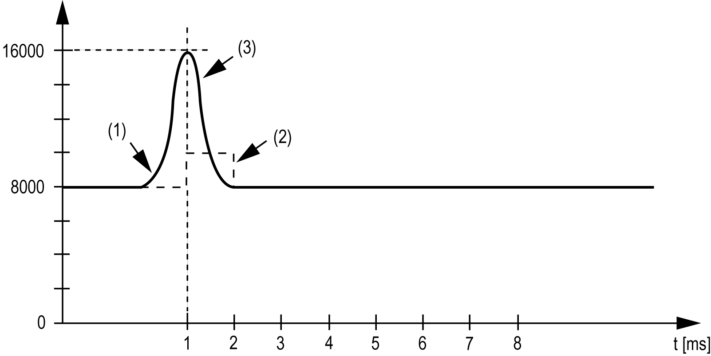

# TM5SMM6D2L

## Introduction

The TM5SMM6D2L expansion electronic modules is a mixed module with 4 digital inputs, 2 digital outputs, 1 analog input, and 1 analog output.

If you have wired your input for a voltage measurement, and you configure EcoStruxure Machine Expert for a current type of configuration, you may permanently damage the electronic module.

| NOTICE | |
| --- | --- |
|  | INOPERABLE EQUIPMENT  Verify that the physical wiring of the analog circuit is compatible with the software configuration for the analog channel.  Failure to follow these instructions can result in equipment damage. |

For further information, refer to [TM5SMM6D2L Electronic Module 4DI/2DO 24Vdc Tr 0.5A / 1AI/1AO ±10V/0-20mA 12 Bits 1 Wire](../../../../../api/crossBook?lang=en-US&virtualBookName=tm5diohw&topicID=D_SE_0018332).

## Analog Inputs

The input status is registered with a fixed offset with respect to the network cycle and is transferred in the same cycle.

## Input Cycle

The electronic module is equipped with a configurable Input cycle. Filtering is deactivated for shorter cycle times.

If the Input cycle is active, then the channels are scanned in millisecond cycles. The time offset between the channels is 200 µs. The conversion takes place asynchronously to the network cycle.

## Limit Values

You can define 2 different types of limits:

* Lower limit
* Upper limit

The Lower limit value range is between -32768 and 32767. This value is applied on every channel of the module being configured.

NOTE: the Lower limit cannot be greater than the Upper limit.

| Channel Configuration | Digital Value Behavior | Comments |
| --- | --- | --- |
| ± 10 V | -10 V = -32768  +10 V = +32767 | If the Lower limit value is configured between -32768 and +32767, the digital value is limited to the Lower limit value. |
| 0...20 mA | 0 mA = 0  20 mA = +32767 | If the Lower limit value is configured between -32768 and 0, the digital value is limited to 0.  If the Lower limit value is configured between 0 and 32767, the digital value is limited to the Lower limit value. |
| 4...20 mA | 0 mA = -8192  4 mA = 0  20 mA = +32767 | If the Lower limit is configured between -32768 and -8192, the digital value is limited to -8192.  If the Lower limit is configured between -8192 and 32767, the digital value is limited to the Lower limit value. |

The Upper limit value range is between -32768 and 32767. This value is applied on every channel of the module being configured.

NOTE: The Upper limit value cannot be less than the Lower limit value.

| Channel Configuration | Digital Value Behavior | Comments |
| --- | --- | --- |
| ± 10 V | -10 V = -32768  +10 V = +32767 | If the Upper limit value is configured between -32768 and +32767, the digital value is limited to the Upper limit value. |
| 0...20 mA | 0 mA = 0  20 mA = +32767 | If the Upper limit value is configured between -32768 and 0, the digital value stays at 0; hence, set the Upper limit value to a positive value.  If the Upper limit value is configured between 1 and +32767, the digital value is limited to the Upper limit value. |
| 4...20 mA | 0 mA = -8192  4 mA = 0  20 mA = +32767 | If the Upper limit value is configured between -32768 and -8192, the digital value is limited to -8192.  If the Upper limit value is configured between -8192 and 32767, the digital value is limited to the Upper limit value. |

## Filter Level

The input value is evaluated according to the filter level. An input ramp limitation can then be applied using this evaluation.

Formula for the evaluation of the input value:

The following examples show the function of the input ramp limitation based on an input jump and a disturbance.

**Example 1**: The input value makes a jump from 8000 to 16000. The diagram displays the evaluated value with the following settings:

Input ramp limitation = 0

Filter level = 2 or 4

**1** Input value.

**2** Evaluated value: Filter level 2

**3** Evaluated value: Filter level 4

**4** Input jump

**Example 2**: A disturbance is imposed on the input value. The diagram shows the evaluated value with the following settings:

Input ramp limitation = 0

Filter level = 2 or 4

**1** Input value

**2** Evaluated value: Filter level 2

**3** Evaluated value: Filter level 4

**4** Disturbance (Spike)

## Input Ramp Limitation

Input ramp limitation can only take place when a filter is used. Input ramp limitation is executed before filtering takes place.

The change in the input value is verified to make sure that the specified limits are not exceeded. If the values are exceeded, the adjusted input value is equal to the previous value ± the limit value.

The input ramp limitation is well suited for suppressing disturbances (spikes). The following examples show the function of the input ramp limitation based on an input jump and a disturbance.

**Example 1**: The input value makes a jump from 8,000 to 17,000. The diagram displays the adjusted input value for the following settings:

Input ramp limitation = 2047

Filter level = 2

**1** Input value

**2** Internal adjusted input value before filter

**3** Input jump

**Example 2**: A disturbance is imposed on the input value. The diagram shows the adjusted input value with the following settings:

Input ramp limitation = 2047

Filter level = 2

**1** Input value

**2** Internal adjusted input value before filter

**3** Disturbance (Spike)

## TM5 Module I/O Mapping Tab

Variables can be defined and named in the TM5 Module I/O Mapping tab. Additional information such as topological addressing is also provided in this tab.

This table describes the I/O Mapping:

| Variable | Channel | | Type | Description |
| --- | --- | --- | --- | --- |
| Inputs | Digital Inputs | | BYTE | State of all inputs. |
|  | DigitalInput00 | BOOL | State of input 0. |
| ... |  | ... |
| DigitalInput03 | BOOL | State of input 3. |
| StatusDigitalOutput00 | BOOL | Status bit associated to each output:   * 0: OK * 1: error detected |
| StatusDigitalOutput01 | BOOL |
| reserved | BOOL | reserved |
| reserved | BOOL | reserved |
| Analogue Input | | INT | Value of the analog input. |
|  | Bit0 | BOOL | – |
| ... |  | ... |
| Bit15 | BOOL | – |
| Outputs | Reset Counter | | BYTE | Status of bits of reset counter. |
|  | Configuration Bit 0 | BOOL | Counter configuration. |
| ... |  |  |
| Configuration Bit 3 | BOOL | Counter configuration. |
| reserved | | BOOL | reserved. |
| ResetCounter 0 | | BOOL | Reset event counter 0; 1=reset. |
| Mode Bit 0 | | BOOL | * 00: Event counter * 01: Gate measurement |
| Mode Bit 1 | | BOOL | * 00: Event counter * 01: Gate measurement |
| DigitalOutputs | | BYTE | Command word of the outputs. |
|  | DigitalOutput00 | BOOL | Command bit of output 0. |
| DigitalOutput01 | Command bit of output 1. |
| Analogue Output | | INT | Value of the analog output. |
|  | Bit0 | BOOL | – |
| ... |  | ... |
| Bit15 | BOOL | – |

For further generic descriptions, refer to [User-Defined Parameters Tab Description](D-SE-0005771.html#D-SE-0005771__D-SE-0005771.5).

## User-Defined Parameters Tab

This table describes the TM5SMM6D2L user-defined parameters configuration:

| Name | Value | Default Value | Description |
| --- | --- | --- | --- |
| InputFilterDI | 0...127 | 10 | Definition of the [filter level](#D-SE-0018491__D-SE-0018491.14). |
| InputFilterAI | off  level 2  level 4  level 8  level 16  level 32  level 64  level 128 | off | Definition of the [filter level](#D-SE-0018491__D-SE-0018491.14). |
| InputLimitationAI | off  16383  8191  4095  2047  1023  511  255 | 16383 | Specifies the limitation of [input ramp](#D-SE-0018491__D-SE-0018491.15).  NOTE: Parameter available if an input filter is selected. |
| ChannelType01AI | -10 V to +10 V  0 to 20 mA  4 to 20 mA | -10 V to +10 V | Specifies the channel type. |
| ChannelType01AO | -10 V to +10 V  0 to 20 mA | -10 V to +10 V | Specifies the channel type. |
| LowerLimitAI | -32768...32767 | -32767 | Specifies the lower [measurement limit](#D-SE-0018491__D-SE-0018491.16). |
| UpperLimitAI | -32768...32767 | 32767 | Specifies the upper [measurement limit](#D-SE-0018491__D-SE-0018491.16). |

EIO0000003179.01