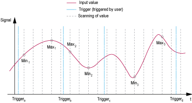

# TM5SAI2H and TM5SAI4H

## Introduction

The TM5SAI2H and TM5SAI4H expansion electronic modules are 10 Vdc Analog Input electronic modules with 2 and 4 inputs respectively.

If you have wired your input for a voltage measurement and you configure EcoStruxure Machine Expert for a current type of configuration, you may permanently damage the electronic module.

| NOTICE | |
| --- | --- |
|  | INOPERABLE EQUIPMENT  Verify that the physical wiring of the analog circuit is compatible with the software configuration for the analog channel.  Failure to follow these instructions can result in equipment damage. |

For further information, refer to the Hardware Guide:

| Reference | Refer to |
| --- | --- |
| TM5SAI2H | [TM5SAI2H Electronic Module 2AI ±10V/0-20mA 16 Bits](../../../../../api/crossBook?lang=en-US&virtualBookName=tm5aiohw&topicID=D_SE_0001847) |
| TM5SAI4H | [TM5SAI4H Electronic Module 4AI ±10V/0-20mA 16 Bits](../../../../../api/crossBook?lang=en-US&virtualBookName=tm5aiohw&topicID=D_SE_0001848) |

## Limit Values

You can specify an upper and lower limit value for each individual channel.

When activated, the input signals are monitored to verify whether the limit values are exceeded. The defined limit values are used for this. If the analog value goes beyond the defined range, then it is limited to the upper or lower limit value.

The result of the signal check is displayed in a corresponding status bit. If necessary, the counters are incremented by one if the value falls outside the range.

## Scaling

The raw A/D converter data and the filtered A/D converter data are compared. The system measure and your measure are grouped internally as a k/d pair to optimize the execution time. Gain and offset can be specified for each individual channel.

## Minimum and Maximum Input Values

The system stores the minimum and maximum values between two trigger events. The function is started by the corresponding trigger edge. The following edges are evaluated depending on the configuration:

* Positive edge
* Negative edge
* Positive and negative edge

The trigger counter counts valid trigger events. In the event that trigger events occur faster than the sampling cycle, the triggering becomes invalid (trigger detected error counter is incremented).

The following example shows how the minimum and maximum input values are recorded:

| Trigger Event | Description |
| --- | --- |
| Trigger a | The function is started. The system notes the minimum and maximum values of the input signal. Ignore the Min./Max values registered by the status bit after the initial start. |
| Trigger b | The minimum value (Min1) and the maximum value (Max1) between Trigger a and Trigger b are given to the register and the new cycle is started. A status bit informs you as soon as the values are valid. |
| Trigger c | The minimum value (Min2) and the maximum value (Max2) between Trigger b and Trigger c are given to the register and the new cycle is started. A status bit informs you as soon as the values are valid. |
| Trigger d | The minimum value (Min3) and the maximum value (Max3) between Trigger c and Trigger d are given to the register and the new cycle is started. A status bit informs you as soon as the values are valid. |

## Input Cycle

The electronic module has an Input cycle that can be configured separately for each individual channel. The order and cut-off frequency can be specified for each individual channel:

* Filter Order: 1...4 (default: 1)
* Filter Cut-off frequency: 1...65535 Hz (default: 500 Hz)

## TM5 Module I/O Mapping Tab

Variables can be defined and named in the TM5 Module I/O Mapping tab. Additional information such as topological addressing is also provided in this tab.

This table describes the I/O mapping configuration:

| Channel | Type | Description |
| --- | --- | --- |
| ModuleOK | BYTE | State of the compact I/O and electronic modules |
| DcOk | BOOL | Voltage range:   * 0: Invalid * 1: Valid |
| reserved | BOOL | Reserved |
| NetworkOk | BOOL | TM5 bus:   * 0: Bus error * 1: OK |
| I/O Data valid | BOOL | Data validity:   * 0: Valid * 1: Invalid |
| reserved | BOOL | Reserved |
| reserved | BOOL | Reserved |
| reserved | BOOL | Reserved |
| reserved | BOOL | Reserved |

|  |  |  |  |  |
| --- | --- | --- | --- | --- |
| Status | Status | | BYTE | State of all inputs |
|  | Status Analog Input 01 | BOOL | Status of analog inputs:   * 0: Ok. * 1: Error |
| ... | ... |
| Status Analog Input 04 | Status of analog inputs:   * 0: Ok. * 1: Error |
| reserved | reserved |
| reserved | reserved |
| synchronisation TM5 to conversion cycle | Synchronisation TM5 to conversion cycle:   * 0: Synchronisation ok * 1: Synchronisation error |
| Conversion Cycle | Status conversion cycle:   * 0: Ok * 1: Error |
| Inputs | AnalogInput00 | | INT | Value of input 0 |
| ... | | ... |
| AnalogInput03 | | Value of input 3 |

For further generic descriptions, refer to [User-Defined Parameters Tab Description](D-SE-0005771.html#D-SE-0005771__D-SE-0005771.5).

## User-Defined Parameters Tab

This table describes the TM5SAI2H and TM5SAI4H user-defined parameters configuration:

| Name | Value | Default Value | Description |
| --- | --- | --- | --- |
| ChannelFilter01 | off  on | off | Enables/disables the channel filter. |
| MinMaxCheck01 | off  positive | off | Activates the [minimum and maximum channel values](#D-SE-0004025__D-SE-0004025.13). |
| ChannelErrCheck01 | off  on | on | Detects an error on the channel. |
| ChannelType01 | -10 V to +10 V  0 to 20 mA | -10 V to +10 V | Specifies the channel type. |
| MinLimit01 | -32768...32767 | -32767 | [Limitation minimum value](#D-SE-0004025__D-SE-0004025.12). |
| MaxLimit01 | -32768...32767 | 32767 | [Limitation maximum value](#D-SE-0004025__D-SE-0004025.12). |
| UserGain01 | -2,147,483,648...2,147,483,647 | 65536 | The user-defined gain for the A/D converter data of the respective physical channel can be specified in these registers. The value 65536 (10000 hex) corresponds to a gain of 1. |
| Useroffset01 | -2,147,483,648...2,147,483,647 | 0 | The user-defined offset for the A/D converter data of the respective physical channel can be specified in this register. The value 65536 (10000 hex) corresponds to an offset of 1. |
| FilterOrder01 | 1...4 | 1 | Filter order selection. |
| FilterConstant01 | 1...65535 | 500 | Cutoff frequency in Hertz. |
| ... |  |  |  |
| ChannelFilter04 | off  on | off | Enables/disables the channel filter. |
| ChannelErrCheck04 | off  on | on | Detects an error on the channel. |
| ChannelType04 | -10 V to +10 V  0 to 20 mA | -10 V to +10 V | Specifies the channel type. |
| MinLimit04 | -32768...32767 | -32767 | [Limitation minimum value](#D-SE-0004025__D-SE-0004025.12). |
| MaxLimit04 | -32768...32767 | 32767 | [Limitation maximum value](#D-SE-0004025__D-SE-0004025.12). |
| UserGain04 | -2,147,483,648...2,147,483,647 | 65536 | The user-defined gain for the A/D converter data of the respective physical channel can be specified in these registers. The value 65536 (10000 hex) corresponds to a gain of 1. |
| Useroffset04 | -2,147,483,648...2,147,483,647 | 0 | The user-defined offset for the A/D converter data of the respective physical channel can be specified in this register. The value 65536 (10000 hex) corresponds to an offset of 1. |
| FilterOrder04 | 1...4 | 1 | Filter order selection. |
| FilterConstant04 | 1...65535 | 500 | Cutoff frequency in Hertz. |
| SampleTime | 50...10000 | 100 | The sampling time is set to µs in this register. This makes it possible to improve the sampling cycle (resolution = 1 µs). The lowest configurable cycle time is 50 µs. |

EIO0000003179.01