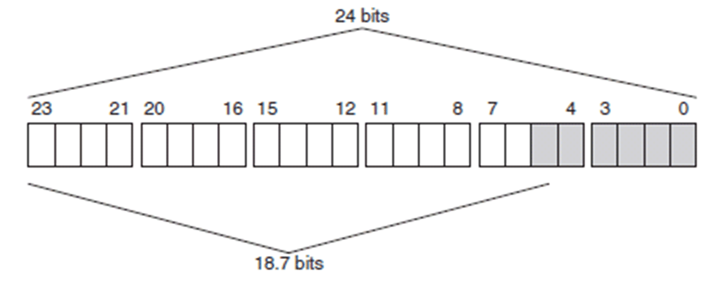

# Effective Resolution

## Overview

Through the Sigma-Delta conversion method of the analog signals on the TM5SEAISG, there is, in principal, an effective resolution of the displayed value.

If the ADC of the TM5SEAISG outputs a 24-bit value, the attainable resolution according to calculation is smaller than the 24-bit converter resolution. The effective resolution depends on the data rate and the bridge factor defined in the ConfiguOutput00 ADC configuration register.

For example, a data rate of 2.5 Hz and a bridge factor of 2 mV/Vdc result in an effective resolution of 18.7 bits. Therefore, the amount of information in the low-order bits (marked in gray) is only natural in theory and is subject to heavy disturbances.

## Strain Gauge Value

The AnalogInput00 channel contains the raw value of the ADC for the full-bridge strain gauge with 24-bit resolution.

The tables below provides the effective resolution (in bits) of the full-bridge strain gauge value depending on the electronic module configuration (data rate, bridge factor). Refer to [ADC Configuration Register](D-SE-0020724.html#D-SE-0020724__D-SE-0020724.28).

|  | Bridge factor | | | |
| --- | --- | --- | --- | --- |
| ± 16 mV/Vdc | ± 8 mV/Vdc | ± 4 mV/Vdc | ± 2 mV/Vdc |
| Data rate (Hz) | Bits | Bits | Bits | Bits |
| 2.5 | 21.3 | 20.8 | 19.7 | 18.7 |
| 5 | 20.7 | 20.3 | 19.3 | 18.3 |
| 10 | 20.4 | 19.9 | 18.9 | 17.9 |
| 15 | 20.1 | 19.3 | 18.7 | 17.7 |
| 25 | 19.7 | 19.2 | 18.5 | 17.5 |
| 30 | 19.6 | 19.0 | 18.1 | 17.1 |
| 50 | 19.4 | 18.8 | 17.9 | 16.9 |
| 60 | 19.3 | 18.8 | 17.8 | 16.8 |
| 100 | 19.1 | 18.5 | 17.4 | 16.4 |
| 500 | 18.0 | 17.3 | 16.3 | 15.3 |
| 1000 | 17.2 | 16.5 | 15.6 | 14.6 |
| 2000 | 16.6 | 16.1 | 15.3 | 14.3 |
| 3750 | 16.2 | 15.7 | 14.7 | 13.7 |
| 7500 | 15.8 | 15.3 | 14.4 | 13.4 |

|  | Bridge factor | | | |
| --- | --- | --- | --- | --- |
| ± 256 mV/Vdc | ± 128 mV/Vdc | ± 64 mV/Vdc | ± 32 mV/Vdc |
| Data rate (Hz) | Bits | Bits | Bits | Bits |
| 2.5 | 23 | 22.6 | 22.1 | 21.7 |
| 5 | 22.3 | 22.4 | 21.9 | 21.3 |
| 10 | 22.3 | 22 | 21.6 | 21 |
| 15 | 22 | 21.7 | 21.3 | 20.7 |
| 25 | 21.8 | 21.4 | 21.1 | 20.5 |
| 30 | 21.7 | 21.3 | 20.8 | 20.4 |
| 50 | 21.3 | 21.1 | 20.5 | 19.9 |
| 60 | 21.3 | 20.9 | 20.4 | 19.8 |
| 100 | 20.9 | 20.7 | 20.2 | 19.6 |
| 500 | 20.1 | 19.6 | 19.1 | 18.6 |
| 1000 | 19 | 18.6 | 18.1 | 17.5 |
| 2000 | 18.5 | 18.1 | 17.8 | 17 |
| 3750 | 18.1 | 17.8 | 17.3 | 16.6 |
| 7500 | 17.7 | 17.3 | 16.9 | 16.2 |

EIO0000003179.01