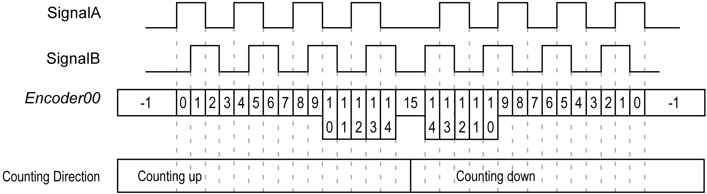

# TM5SE1IC02505

## Introduction

The TM5SE1IC02505 expansion electronic module is a 5 Vdc or 24 Vdc Expert Inputs electronic module with 1 input channel for ABR incremental encoder.

The encoder signal is counted as shown below:

For further information, refer to [TM5SE1IC02505 Electronic Module 1 HSC INC 250 kHz 5 Vdc](../../../../../api/crossBook?lang=en-US&virtualBookName=tm5exphw&topicID=D_SE_0002186).

## TM5 Module I/O Mapping Tab

Variables can be defined and named in the TM5 Module I/O Mapping tab. Additional information such as topological addressing is also provided in this tab.

This table describes the I/O mapping configuration:

| Channel | Type | Description |
| --- | --- | --- |
| ModuleOK | BYTE | State of the compact I/O and electronic modules |
| DcOk | BOOL | Voltage range:   * 0: Invalid * 1: Valid |
| reserved | BOOL | Reserved |
| NetworkOk | BOOL | TM5 bus:   * 0: Bus error * 1: OK |
| I/O Data valid | BOOL | Data validity:   * 0: Valid * 1: Invalid |
| reserved | BOOL | Reserved |
| reserved | BOOL | Reserved |
| reserved | BOOL | Reserved |
| reserved | BOOL | Reserved |

|  |  |  |  |  |
| --- | --- | --- | --- | --- |
| - | PowerSupply | | BYTE | Status encoder supply |
|  | PowerSupply01 | BOOL | Status encoder supply 24 Vdc (0 = OK) |
| PowerSupply02 | Status encoder supply 5 Vdc (0 = OK) |
| Inputs | Inputs | | BYTE | State of all digital inputs (bits 6...7: not used) |
|  | SignalA | BOOL | Encoder Signal A |
| SignalB | BOOL | Encoder Signal B |
| SignalR | BOOL | Encoder Reference Impulse |
| reserved | BOOL | reserved |
| DigitalInput01 | BOOL | State of digital input 0 |
| DigitalInput02 | BOOL | State of digital input 1 |
| reserved | BOOL | reserved |
| reserved | BOOL | reserved |
| - | Encoder01 | | DINT | Incremental encoder |
| - | StatusInput01 | | BYTE | Status incremental encoder 01 (see below) |
| - | ReferenceModeEncoder01 | | BYTE | Reference mode incremental encoder 01 |

For further generic descriptions, refer to [User-Defined Parameters Tab Description](D-SE-0005771.html#D-SE-0005771__D-SE-0005771.5).

## StatusInput01 Register

This register contains information regarding whether the referencing process is off, active, or complete.

This table describes the **StatusInput01** register:

| Bit | Description |
| --- | --- |
| 0-1 | Always 0 |
| 2 | When the referencing is ON, this bit is 1 after the first reference impulse. When the referencing is OFF, this bit is 0. |
| 3 | When the referencing is ON, this bit toggles after each completed reference. When the referencing is OFF, this bit is 0. |
| 4 | This bit is 1 after the first reference impulse. |
| 5...7 | Free-running counter, increased with each reference impulse. |

Example:

| Register Value | | Description |
| --- | --- | --- |
| 00000000 bin | 00 hex | Referencing off or already in progress. |
| 00111100 bin | 3C hex | First reference complete, reference value applied in the **Encoder00** register. |
| xxx11100 bin | xB hex | Bits 5...7 are changed sequentially with each reference impulse. |
| xxx1x100 bin | xx hex | Bits changed continuously with the continuous referencing setting. With every reference impulse, the reference value is applied to the **Encoder00** register. |

## ReferenceModeEncoder01 Register

This register determines the encoder reference mode.

This table describes the **ReferenceModeEncoder01** register:

| Bit | Value | Description |
| --- | --- | --- |
| 0-1 | 00 | Referencing OFF |
| 01 | One-time reference (single shot) |
| 11 | Continuous referencing |
| 2...5 | 0000 | Bit permanently set = 0 |
| 6-7 | 00 | Referencing OFF |

Example:

| Register Value | | Description |
| --- | --- | --- |
| 00000000 bin | 00 hex | Referencing OFF |
| 11000001 bin | C1 hex | One-time reference (single shot).  When starting over after the referencing process is complete, set this register to 00 hex. Then wait until the **StatusInput00** also takes on the value x0 hex. |
| 11000011 bin | C3 hex | Continuous referencing: referencing occurs at every reference pulse. |

## User-Defined Parameters Tab

This table describes the TM5SE1IC02505 user-defined parameters configuration:

| Name | Value | Default Value | Description |
| --- | --- | --- | --- |
| PresetABR01\_32Bit | -2,147,483,648...2,147,483,647 | 0 | Homing preset value for counter; the value set here is applied to the counter value upon completion of the referencing process. |
| ReferenceEdge | Off  rising  falling | Off | Selects edge of reference pulse for homing. |
| ReferenceEnableSwitch | low active  high active | low active | Digital input 01 configure edge. |
| ReferenceEnableSwitch | disabled  enabled | disabled | Enables/Disables the above parameter |

EIO0000003179.01