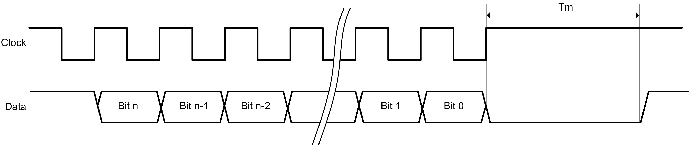
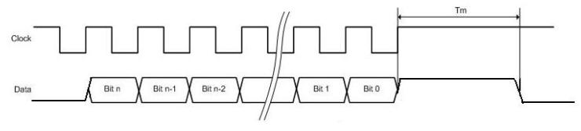

# TM5SE1SC10005

## Introduction

The TM5SE1SC10005 expansion electronic module is a 5 Vdc or 24 Vdc Expert Inputs electronic module with 1 input channel for SSI absolute encoder.

For further information, refer to [TM5SE1SC10005 Electronic Module 1 HSC SSI 1 Mb 5 Vdc](../../../../../api/crossBook?lang=en-US&virtualBookName=tm5exphw&topicID=D_SE_0002189).

## Monoflop Check Parameter

The **Monoflop check** parameter is used to test the data line level before starting data transmission: the clock starts only if the data line level is equal to the specified level.

This level is programmable, you can choose to perform the test or not.

If you test the level, you can select its value (0 or 1) via the interface.

The data line level is verified from Tm after the last rising edge of the clock line

In the example 1, the **Monoflop check** parameter must be configured to high level so that the clock generation is postponed until the data line goes high.

In the example 2 the **Monoflop check** parameter must be configured to low level so that the clock generation is postponed until the data line goes low.

## TM5 Module I/O Mapping Tab

Variables can be defined and named in the TM5 Module I/O Mapping tab. Additional information such as topological addressing is also provided in this tab.

This table describes the I/O mapping configuration:

| Channel | Type | Description |
| --- | --- | --- |
| ModuleOK | BYTE | State of the compact I/O and electronic modules |
| DcOk | BOOL | Voltage range:   * 0: Invalid * 1: Valid |
| reserved | BOOL | Reserved |
| NetworkOk | BOOL | TM5 bus:   * 0: Bus error * 1: OK |
| I/O Data valid | BOOL | Data validity:   * 0: Valid * 1: Invalid |
| reserved | BOOL | Reserved |
| reserved | BOOL | Reserved |
| reserved | BOOL | Reserved |
| reserved | BOOL | Reserved |

|  |  |  |  |  |  |
| --- | --- | --- | --- | --- | --- |
| - | PowerSupply | | BYTE | - | Status encoder supply (bits 2...7: not used) |
|  | PowerSupply01 | BOOL | - | Status encoder supply 24 Vdc (0 = OK) |
| PowerSupply02 | BOOL | - | Status encoder supply 5 Vdc (0 = OK) |
| Inputs | Inputs | | BYTE | - | State of all digital inputs (bits 0...3, 6-7: not used) |
|  | reserved | BOOL | - | Reserved |
| ... |
| reserved |
| DigitalInput01 | State of digital input 0 |
| DigitalInput02 | State of digital input 1 |
| Encoder01 | | DINT | - | Encoder position value |

For further generic descriptions, refer to [User-Defined Parameters Tab Description](D-SE-0005771.html#D-SE-0005771__D-SE-0005771.5).

## User-Defined Parameters Tab

This table describes the TM5SE1SC10005 user-defined parameters configuration:

| Name | Value | Default Value | Description |
| --- | --- | --- | --- |
| DataFormat | binary  gray | binary | Data format of SSI encoder. |
| Baudrate | 1 MHz  500 kHz  250 kHz  125 kHz | 1 MHz | Define the clock rate. |
| TotalBitLength | 0...32 | 0 | Number of bits sent by the SSI encoder per frame. |
| ValidBitLength | 0...32 | 0 | Significant part of the SSI encoder frame. Only the least significant part of the total SSI encoder frame is valid. The complementary most significant part of the frame is ignored and read as 0. |
| monoflopCheck | high level  low level  ignore | high level | Data line level is verified before starting data emission. |

EIO0000003179.01