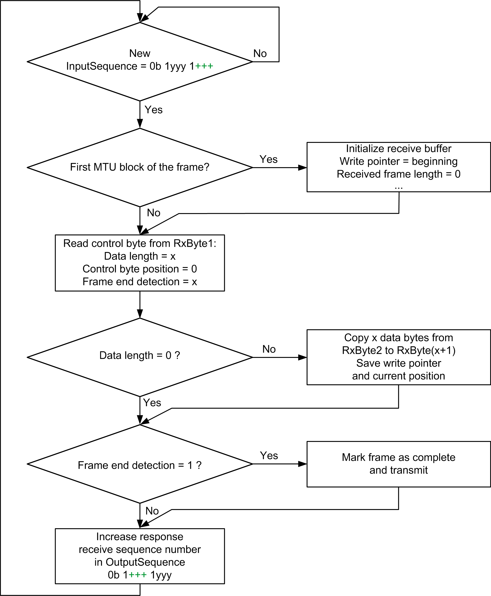
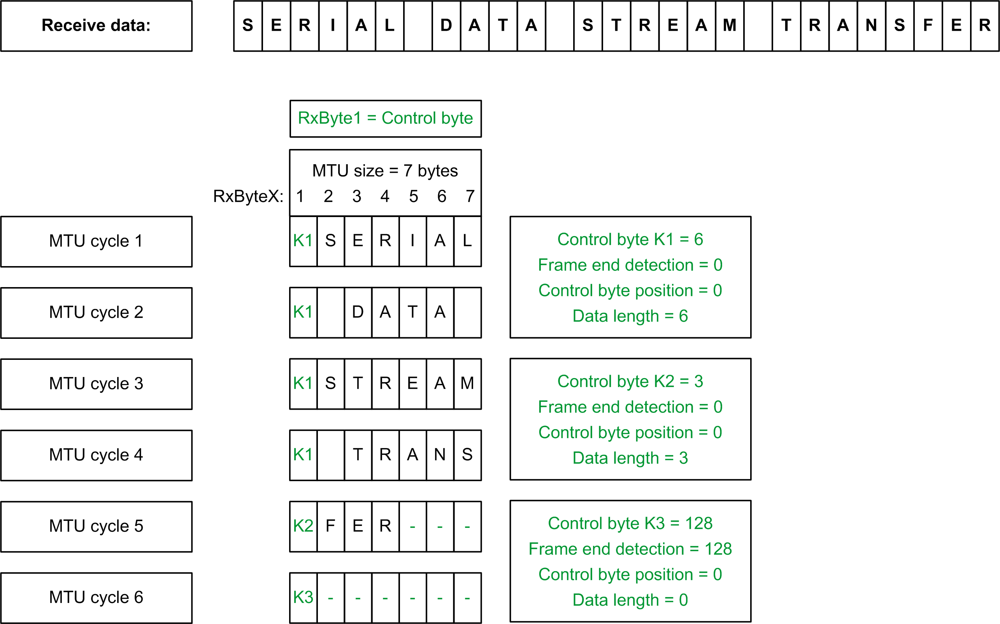

# Receive Data: Read Cyclic Data, Maximizing Control, and Monitoring

## General

In contrast to sending, when receiving the behavior regarding the use of the MTU by the module is determined by the configuration.

## Configuration

To maximize control and monitoring of the individual steps, set the configuration as follows:

* Multiple segments within an MTU are not permitted
* Segment size does not exceed MTU size
* Use or not of the Block Forward  mechanism makes no difference to MTU processing

| Step | Action |
| --- | --- |
| 1 | Verify whether the receiver sequence number in the OutputSequence has changed since the last cycle.  If it has changed, RxByte1 is a control byte. If it is the start of a frame, the receive buffer must be initialized (write pointer to start of buffer, received frame length = 0, and so on). |
| 2 | Evaluate the control byte information in RxByte1 to determine the length of data in the MTU and whether frame end detection has been set. |
| 3 | If data are available, copy the first block of serial data from RxByte2 to RxByteX.  Save the write pointer position and add the new frame length. If frame end detection has been set, mark the frame as complete. |
| 4 | Increase the value of the receiver sequence number acknowledgment in the OutputSequence. If Block Forward = 1, the next MTU block is prepared only after the module has received acknowledgment of the cyclic transfer. If Block Forward = 2 to 7, the module does not wait for individual acknowledgments, but creates new MTU blocks until the specified number of blocks is reached. |
| 5 | Repeat steps 1 to 4 until the serial data have been received in blocks. |

## Data Reception Flow Chart: Maximum Control With/Without Block Forward

## Example of Partitioning Control Byte and Received Data

The MTU is configured to 7 bytes. A frame with 27 bytes is received.

EIO0000003179.01