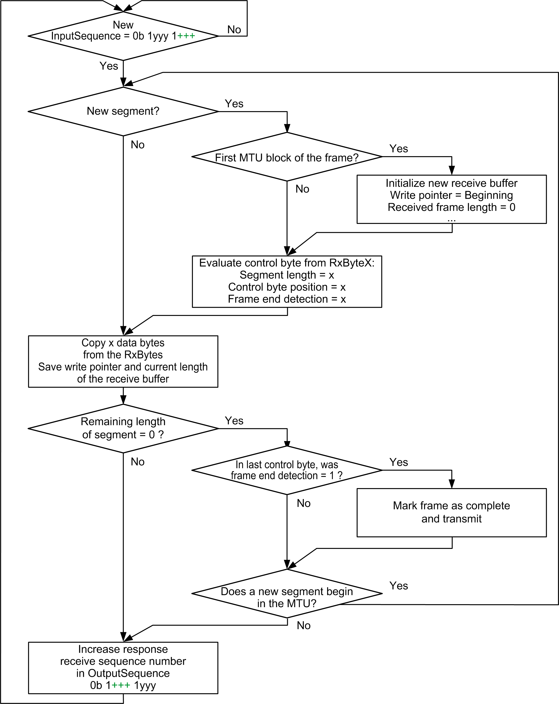
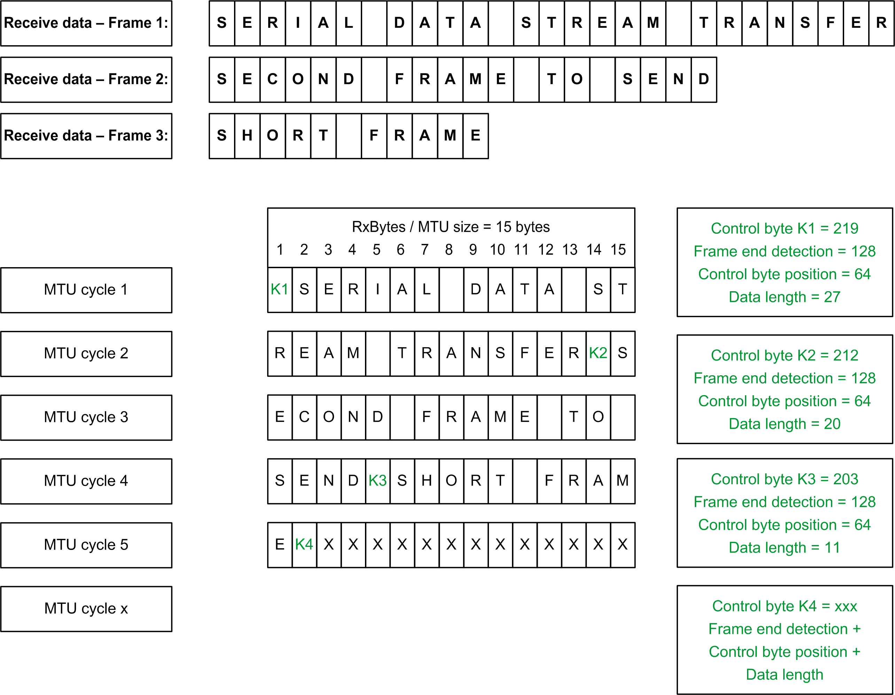

# Receive Data: Read Cyclic Data, Maximizing Data Throughput

## General

In contrast to sending, when receiving the behavior regarding the use of the MTU by the module is determined by the configuration.

## Configuration

To maximize data throughput, set the configuration as follows:

* Multiple segments within MTU permitted: control byte position = 1. The last data byte of the segment is immediately followed by the control byte for the next segment.
* Segment size may exceed the MTU size: only the first MTU of the segment contains the control byte of the segment, the following MTU blocks only contain data.
* Use the Block Forward mechanism: the module transfers up to seven unacknowledged MTU blocks.

| Step | Action |
| --- | --- |
| 1 | Verify whether the receive sequence number has changed since the last cycle.  If it is the beginning of a frame, initialize the receiver buffer (write pointer to start of buffer, received frame length = 0, and so on). The optimized transfer means that several short frames may be contained in one MTU, so it must be possible to manage a sufficient number of receive buffers with the application.  Determine the control byte position in the MTU. If RxByte1 is the control byte, it is an MTU containing no residual data of the previous segment (or frame). If the first unallocated RxBytex is the control byte for the new segment, it is an MTU containing residual data of the previous frame. MTU blocks within a segment do not necessarily have a control byte. |
| 2 | Evaluate the control byte information from RxBytex. Determine the data length, segment length, and next control byte position. If frame end detection is set, it is the last segment. |
| 3 | If data are available, copy the block of serial data starting from RxBytex. Save the write pointer position and add the new frame length.  Calculate the residual length of the segment. The next RxBytex may already be a control byte for the next segment or frame. When frame end detection is set and the data have been copied, mark the frame as complete. |
| 4 | Increase the value of the receiver sequence number acknowledgment in the OutputSequence. |
| 5 | Repeat steps 1 to 4 until the serial data have been received in blocks. |

## Data Reception Flow Chart: Optimize Data Throughput

## Example of Partitioning Control Byte and Transmission Data

The MTU is configured to 15 bytes, frames are being received: 27 bytes, 20 bytes, 11 bytes,...

EIO0000003179.01