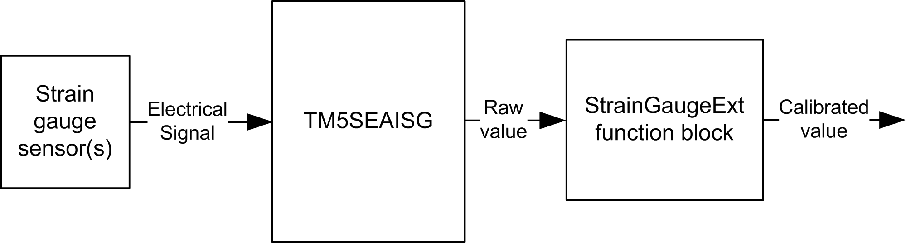

# Measurement Cycle

Measurement Cycle

The measurement system is shown in the following diagram:

Your measurement system is created through the [configuration](../../../../../../api/crossBook?lang=en-US&virtualBookName=tm5prg&topicID=D_SE_0020339_1) of the TM5SEAISG and the usage of the StrainGaugeExt function block.