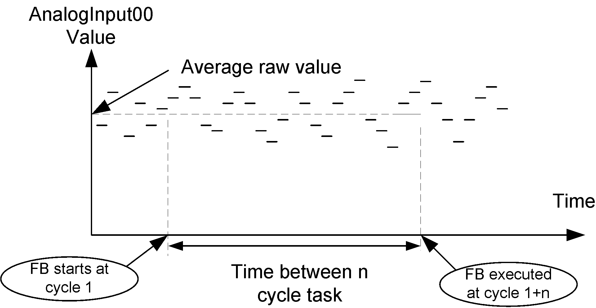

# Overview

Overview

The StrainGaugeExt function block is an extended version of the StrainGauge function block, as it provides the capability to make continuous weight measurement on any type of bus (like TM5 and CANopen).

The StrainGaugeExt function block can be used with TM5SEAISG in local, remote and distributed architectures.

The StrainGauge function block has 3 functions:

omake an average measure of the TM5SEAISG input in a defined period

odefine a linear calibration to match the needs of your process

oprovide a calibrated measure

The average raw value is calculated with all the measures done by the TM5SEAISG module during a define number of task cycles. The number of task cycles is set with the Cycle\_Number input of the function block.

Where n is the Cycle\_number value.