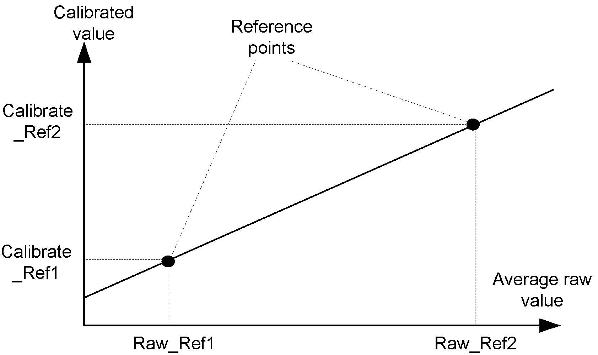

# Procedure

Procedure

The procedure sets the Raw\_Ref2 field of the s\_strainGaugeParameter structure.

Follow these steps to create the first reference point:

| Step | Action |
| --- | --- |
| 1 | Create and stabilize the conditions that are representative of the measurement required for the second reference point. |
| 2 | Set the inputs of the StrainGauge function block to following values:  Tare\_Enable = 0  Ref1\_Enable = 0  Ref2\_Enable = 1 |
| 3 | Set the function block input xExecute to 1. |
| 4 | When xDone = 1, s\_strainGaugeParameter.RawRef2 is set to the average value calculated by the function block. |
| 5 | Set the corresponding calibrated value you wish to associate with Raw\_Ref2 in the s\_strainGaugeParameter.Calibrate\_Ref2. |

Defining both reference points allows to establish the calibration line:

